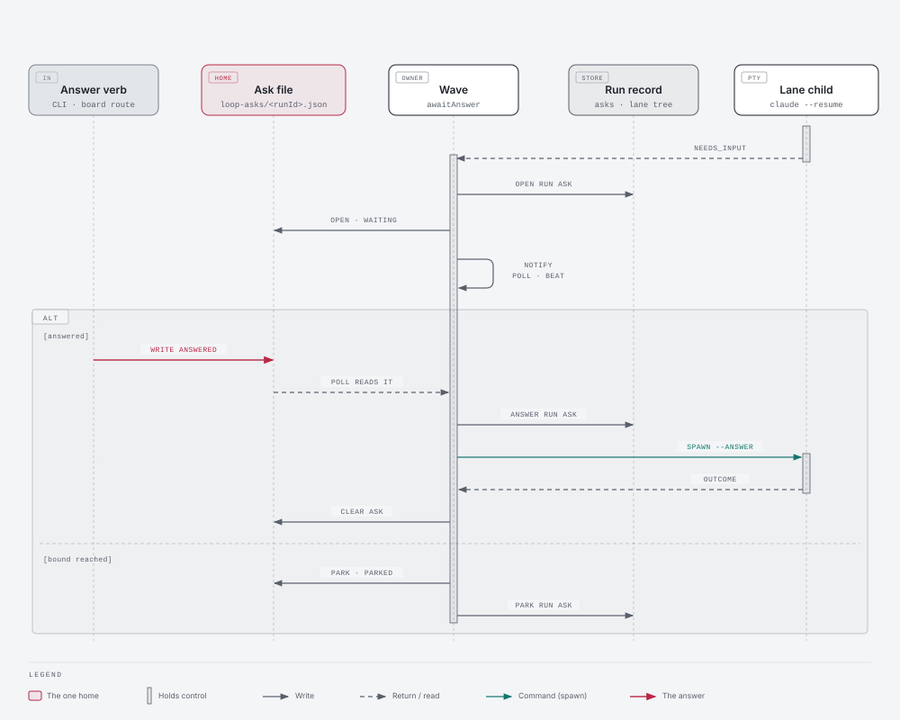

<!--
  Milestone ARCHITECTURE.md — answers ONE question: what did we decide, and why?
  Owner: architect. ADRs are append-only; a superseded decision is marked, never deleted.
  Structural invariants belong here as FITNESS FUNCTIONS (the register at the foot), not in a
  task .feature — a .feature states observable behaviour over a seam, a fitness function states a
  property of the tree.
-->
# 131 · The human in the loop — Architecture

The SPEC made the product decision: a question gets to the human where they are, the human answers
from a terminal, the board or a phone, and the rest of the loop carries on. These ADRs answer the
STATE's six questions in its order and decide HOW. The first answer departs from the SPEC's letter,
and says so. The conversation waits and the process does not. Every other ADR follows from that.
Every value that is a default is marked DEFAULT DECISION with its reason. Contracts are authored
after this document and never re-open it. The Decide stage closes here.

## Memory recall — what was surfaced, and what it changed

`aof work memory recall … --area architecture --block`, run six times, once per ADR: the two waits,
the one reader, the answer's transport, the non-halting lane, the notifier and the board's write
route. Each record is honoured or departed from in writing.

- **`69/ADR-007` + its 2026-08-22 amendment** (*one park concept; the process terminates, the
  conversation does not; the run stays `running`, no new state; the park is a capacity fact
  published after a confirmed exit; posture is not capacity*) → **HONOURED, and it decides
  ADR-001.** The park stops being the last resort and becomes the wait itself. A live-held PTY is
  the "posture moving capacity" double-booking the amendment removed.
- **`38/ADR-013`** (*interactive PTY per assignment; `NEEDS_INPUT` sentinel; a needs-input session
  RETAINS its worktree*) → **HONOURED.** Detection is unchanged. ADR-002 adds one paragraph to the
  producer that the 38 amendment introduced.
- **`63/ADR-006`** (*a mesh loop-call phase touches no NEEDS_INPUT machinery*) → **HONOURED.** The
  unattended argv still carries no needs-input instruction. `mesh-assignment-loop-directive`'s
  assertion holds unedited.
- **`53/ADR-004`** (*resumed, not restored; no new record type or store; zero board change*) →
  **HONOURED as the stance, DEPARTED at two named points.** (1) The record gains a 17th key,
  `asks`, by the same additive supersession `68/ADR-001` used for the 16th (ADR-003 §3). (2) The
  board gains a card. 53's freeze was against a LOOP face, and the card is an ASK face with no cycle,
  level or loop state. `53/FF-5307` is re-pinned with that reason (ADR-006 §4). No store is added:
  the ask file is a request, exactly as 130's stop is.
- **`130/ADR-001` … `130/ADR-003`** (*a durable request in the aof home keyed by run identity,
  polled, never signalled; settle first; a needs-input drive is not settled and an interrupt over
  it names the session*) → **HONOURED as the template.** ADR-003 copies the request's shape. ADR-004
  keeps 130's order (settle → interrupt → needs-input → retry) and parks a waiting run on a stop.
  It never cancels one.
- **`126/ADR-002`** (*the loop narrates in flight through ONE injected printer*) → **HONOURED.** The
  waiting, answered and parked rows ride `narrate`. The halt's ask block rides `report`.
- **`20/ADR-004` + `19/ADR-001`** (*liveness is `heartbeatAt` on the record; five states, five
  edges*) → **HONOURED.** A waiting run is `running` and its owner beats it. No state or edge is
  added.
- **`48/ADR-001`** (*the routable session id is the assistant's own, never fabricated*) →
  **HONOURED.** An answer resumes only the asking run's own `sessionId` (ADR-003 §7).
- **`119/ADR-003`** (*a control may STORE a decision; it must DERIVE a fact*) → **HONOURED.** `asks`
  stores the human's decision (the answer, who, when) and the instants. The wait's charge against
  the budget is derived from those instants and never stored as a `waitedMs`.
- **`17/ADR-004`** (*opt-in config block; auth is an env-var REFERENCE, `tokenEnv`; absent ⇒ honest
  no-op*) → **HONOURED as the precedent for the secret.** `work.notify` channels carry `urlEnv`
  (ADR-005 §1). R8's `AOF_MESH_CLONE_TOKEN` read is the same shape.
- **`38/ADR-012` + `27/ADR-006` + `25/ADR-004`** (*a face's write surface is a named, bounded set;
  loopback-bound, same-origin*) → **HONOURED and TIGHTENED.** The answer route types text into an
  autonomous session with shell access. It is the highest-value write route either face has, so
  admission gains a loopback-`Host` check against DNS rebinding, on both faces (ADR-006 §3).

## Measured facts this document reasons from

Measured 2026-09-23 on `2bf716f` plus the uncommitted 130/131 work. Graph: `graphify-out/graph.json`
built `2026-09-23T16:48:17Z`, used through `aof graph impact` and cited as actual structure. The
debt query (`aof work debt <subject files>`) returned items 18, 33, 40, 55, 59, 76, 83, 87 and 91.
Those on this path are re-measured in *Codebase health*.

| claim | value | source |
|---|---|---|
| every settled outcome kills the PTY | sentinel → `stopForOutcome({needs-input})`; pending `AskUserQuestion` → the watch settles → `stopForOutcome`; both → `releasePty` | `src/agent-session-driver.mjs:1321-1323`, `:1450-1458`, `:1222-1243` |
| resume keeps identity | `claude --resume` KEEPS the session id and appends the SAME transcript (measured 2026-07-27, Mac) | `src/mesh/worker-execution.mjs:1614-1616`, `:1778-1786` |
| resume already types a command | the fix path launches `resumeSessionId` + `composeFixInput(...)` as the typed command; the stale-sentinel baseline guards it | `src/commands/drive.mjs:279-357`; driver `:911-931`, `:1425-1440` |
| typing into a live claude PTY from outside | 42's OPEN FINDING, frozen and unresolved: bytes reach the right pid, claude does not react; the driver still carries its breadcrumb "until that finding resolves" | `archive/42…/STATE.md:562-576`; driver `:986-996` |
| the only measured answered question | 127/02: `--resume` re-drove the SAME session, finished `done` in 4 min | SPEC table |
| the driver's door | exactly 17 exports, pinned by set equality | `test/arch/session/acd-session-driver-single-home.test.mjs:268` (`53/FF-5302`) |
| the question is computed and dropped | `readTranscriptTerminalOutcome` (private) builds `body` and tests two literals | driver `:358-438` |
| the transcript family | the driver imports `claudeProjectsDir` from `src/work/observe.mjs` (1,822 lines, 4 src dependents) | driver `:45`; `aof graph impact` |
| the producer's pins | `NEEDS_INPUT_INSTRUCTION` is a template embedding `${NEEDS_INPUT_SENTINEL}`, composed into `WORKER_SESSION_INSTRUCTION`; its body may hold no `//` or `/*` | `acd-worker-driver-no-headless-print.test.mjs:172-181`; driver `:139-146` |
| the needs-input halt sites | four: shell `:1670`, `cycle.mjs:701` (retry), `cycle.mjs:981` (verify), `wave.mjs:552` (lane) | grep |
| the settle skip | `if (outcome.outcome === "needs-input") return driven;` — the record stays `running`, carries nothing | `src/loop/cycle.mjs:553` |
| the record | 16 keys, `spend` last; pinned in 13 suites and controls | `run-store.mjs:535-553`; grep `"resumeAfter", "spend"` |
| a lane's record | lives in the LANE worktree, invisible to the primary until merge | `wave.mjs` (mint "in the lane") |
| the lane child's channels | `--run`, `--fix <file>`, `--json`; stdin is the cancel channel | `src/loop/child-drive.mjs:109-114` |
| suites that use needs-input to leave a lane open | `loop-command-wave` (×5), `loop-command-reconcile` (×3), `loop-command-stops` (×4) | grep |
| budgets at ceiling | `src/commands` 69/69 (allowance 0); `src/commands/work` refuses a lone member; `src/loop` exempt at 5 (threshold 8); `ui/src/board` 24/24; `DetailPanel.tsx` 995/1000; `worker-execution.mjs` 1,914/1,914 (sink ratchet); every test directory at ceiling | the two budget controls; `acd-session-driver-single-home:66` |
| the board's writes | `/api/work/{continue,refine,verify,resync,feedback}` through `invoke`; the origin check copied at two sites; no `Host` check anywhere; the fleet's `admitWriteRequest` has none either | `src/board-ui.mjs:200-247`; `src/mesh/ui-serve.mjs:1300-1317` |
| the board's ask today | `item.execution` from `global_assignments` rows only; a local lane shows nothing | `src/board-mesh-execution.mjs`; `DetailPanel.tsx:240` |
| coupling | `wave.mjs` ← `commands/loop.mjs` only; `cycle.mjs` ← `loop.mjs`, `wave.mjs`; `child-drive.mjs` ← `wave.mjs`; `commands/resume.mjs`, `list.mjs`, `item-status.mjs`, `drive.mjs` ← `command-core` only; `board-ui.mjs` ← `setup-ui.mjs`; `park-resume.mjs` ← `worker-execution.mjs`; `run-store.mjs` ← 30 src | `aof graph impact` |

---

## ADR-001 — One driver, one wait

**The conversation waits and the process does not. For a local lane, a primary drive and a mesh
worker alike, the answer resumes the SAME run's SAME session by `claude --resume` with the answer
typed as its first input. The live-PTY wait is not built.**

### Context

R1: no code path leaves a driven PTY alive after any settled outcome. The only measured answered
question (127/02) was a `--resume` re-drive of the same session. `claude --resume` keeps the id and
the transcript, and the driver already resumes with a typed command. Typing into a live, turn-ended
claude PTY from outside is 42's unresolved OPEN FINDING: the bytes reached the pid and claude did not
react. R3: a lane's PTY lives in a child process with no input channel. `69/ADR-007`'s amendment
says a held PTY double-books capacity.

### Decision

1. **Park-then-resume is PRIMARY in all three topologies.** The driver's kill semantics are
   untouched. Both needs-input branches still end in `stopForOutcome`. The WAIT belongs to the run's
   owner. The record stays `running` (`69/ADR-007`: no new state) and carries the ask (ADR-003 §3).
   The owner beats the record while it waits. On the answer, the owner re-drives the same `runId`
   at the same attempt: `resumeSessionId` = the ask's session, and the brief's `command` = the
   answer, verbatim.
   - **(a) Local lane:** the wave owns the wait. The re-drive is `spawnLaneDrive` with
     `--answer <askFile>`.
   - **(b) Primary drive** (REFINE, VERIFY, the sequential shell): the in-process loop owns the
     wait. The re-drive is the site's own `drivePhase` with `answer`.
   - **(c) Mesh worker assignment:** the park and the `mesh:terminal-resume` protocol already
     exist. The verb adds the answer to the resume envelope and the worker types it (ADR-003 §5c).
2. **DEPARTURE from the SPEC's "the driver keeps the PTY alive".** The measured reasons are the four
   rows above: the one proven path, an unproven input path, no channel into a lane, and the capacity
   rule. What survives is "waits in place" at the grain an operator sees: the same conversation,
   worktree, run and lane, with the rest of the loop running (ADR-004). What is lost is the live
   mirror of the question on a fleet tile. DESIGN §2 already renders a parked session with no tile.
   The PO ratifies this departure in STATE.
3. **Heartbeat.** No attempt is live during the wait, so there is no deadline to suspend. F-58's
   rule ("waiting is not silence") applies at the RECORD grain. The owner beats the waiting run on
   the wave run's cadence, `heartbeatMs / 3`, through the hook's own queue. The driver's F-58 branch
   is unchanged. A re-drive is a fresh PTY with fresh `startToClose` and heartbeat deadlines.
4. **The outer bound.** The wait ends when `decideScheduleToClose` (the one decider) answers `halt`
   for `elapsedMs = now − max(askedAt, the invocation's start)` against `scheduleToCloseMs`.
   DEFAULT DECISION, for two reasons. A question gets the whole bound however late its lineage asks
   it, because a refine-time ask is the cheap moment the SPEC protects. And `--resume` restarts the
   clock, because the operator chose to bring the loop back. **The wait is charged to nobody:**
   `attemptElapsedMs` subtracts each ask's interval (askedAt → answeredAt ?? parkedAt ?? now), so an
   answered question never exhausts its lineage's budget on the next retry.
5. **Parking is the fallback.** At the bound, or on a stop at either rung, the owner stops waiting.
   It stamps `parkedAt` on the ask and the record, stops beating, and preserves the conversation,
   worktree and run. 69/05's delivered `.feature`s stand unedited. A stop PARKS a waiting run and
   never cancels it. The operator stopped the loop, not the question (`130/ADR-003` §7).
6. **A run resumes only its own conversation.** The drive refuses an answer whose `runId` is not the
   lent run's, or whose `sessionId` is not that record's (`70/FF-7007`'s rule, extended).
7. **The live wait stays additive.** The ask file, the verb and the record do not depend on which
   wait answers. If 42's finding is ever resolved, an owner still holding its PTY may type the
   answer instead of re-spawning, and nothing else changes.

### Alternatives considered

- **Keep the PTY alive and type the answer (the SPEC's letter)** — rejected for §2's reasons. It is
  the one unproven step, and it would sit under every answer.
- **A hybrid (live for the primary, park for lanes)** — rejected: two waits and two code paths over
  the same unproven input.
- **`terminal-input` for a local session** — rejected (R3): it reaches only worker PTY registries.

### Consequences

The driver's kill paths gain nothing. `drive.mjs` gains the `answer` input (ADR-003 §7). 69/05's
contract stands as the base. The wait costs no process and no memory. `53/FF-5302`'s 17 exports hold.

### Invariant

Nothing writes an answer into a live PTY. An answer reaches a session only as the `command` of a
`--resume` re-drive of that run's own session.

---

## ADR-002 — The one reader of the question

**The last-assistant-turn scan MOVES from the driver into `src/work/observe.mjs`, the transcript
family, and is exported there. The question is that turn's own words. The producer gains one
paragraph asking for the form of the ask, and its threshold is untouched.**

### Context

R5: the body is computed and discarded in a private driver function, and `53/FF-5302` freezes the
driver's 17 exports. The driver already imports `claudeProjectsDir` from `observe.mjs`, which also
owns `humanTurnText`, the reader of the other party. A pending `AskUserQuestion` carries its
question in the tool input, not in the text.

### Decision

1. **`readLastAssistantTurn(file, sinceOffset = 0)`** in `observe.mjs` returns `null | { stopReason,
   text, humanInputTool, answered }`. The body is today's scan verbatim: the baseline cut, the
   partial-line drop, the reverse walk, `answeredAfterAssistant`, and the text blocks joined as
   today. The driver's private `readTranscriptTerminalOutcome` becomes a mapping over it with the
   same four answers, and holds no `JSON.parse` walk of its own.
2. **`askQuestionFromTurn(turn)`** is pure and returns `string | null`.
   - For an `end_turn`: the text with every line equal to the sentinel removed, then trimmed.
   - For a pending human-input tool: each question's `question`, then its option labels as
     `- <label>` lines, taken from the tool input.
   - Empty text answers `null`.

   **`readAskQuestion({ cwd, env, sessionId, sinceOffset })`** composes `claudeProjectsDir` and the
   two functions above. It never throws: a fault answers `null` and reports
   `reportDegrade("ask-question-unreadable")`. The owner (ADR-004) is its only caller. Nothing reads
   the PTY buffer for a question.
3. **The producer paragraph.** It is inserted into `NEEDS_INPUT_INSTRUCTION` immediately before the
   sentinel sentence. The threshold sentences stay byte-identical, and the text holds no backtick,
   `//` or `/*`:

   > Before you print it, write your question for a human reading it on a phone, as four short
   > lines that begin exactly "Decision needed:", "Options:", "I would pick:" and "What the answer
   > changes:" — the one decision you need, the options you weighed, the one you would take and
   > why, and which tasks, files or later steps depend on the answer. Keep those four lines under
   > 1,500 characters, and put any detail after them.

   DEFAULT DECISION: the four labels and the 1,500-character guidance. They leave Discord's 2,000
   room for line 1, the action line and the link. The labels make the form checkable without
   re-wording the ask. `WORKER_SESSION_INSTRUCTION`'s composition is unchanged, so invariant 6 of
   `acd-worker-driver-no-headless-print` holds.

### Alternatives considered

- **Export the reader from the driver** — rejected: `53/FF-5302` (an 18th export).
- **A second parser beside the waiter** — rejected: two homes for one read.
- **The PTY buffer** — rejected: TUI reflow, ANSI escapes and truncation. The STATE's own rule.
- **A structured JSON ask** — rejected: it is a second protocol under the sentinel, and not the
  transcript's own words.

### Invariant

The last-assistant-record scan exists once, in `src/work/observe.mjs`. No other `src/**` module walks
a transcript for `stop_reason`.

---

## ADR-003 — The answer's transport

**One ask file in the aof home, owned by `src/loop/ask-request.mjs`. One verb, `work:answer`, JOINS
`src/commands/resume.mjs`. The answer, who gave it and when land on the run record's 17th key,
`asks`, written by the run's owner. The `settleDriven` leak closes because the record now says what
it is waiting for.**

### Context

130's stop request is the pattern (R4). A lane's record sits in a tree the verb cannot see, so the
verb cannot write the record. The board reaches commands through `invoke`, so no core below the
command layer is needed. `src/commands/` is 69/69 with allowance 0, and `src/commands/work/` refuses
a lone member. The driver types the command inside a bracketed paste.

### Decision

1. **Home.** `loopAsksDir(env)` = `path.join(globalMeshPaths({ env }).meshRoot, "loop-asks")`.
   `askRequestPath(dir, runId)` = `<dir>/<runId>.json`. The file is keyed by run, never by ref
   (130's stale-key hazard), and never lives in a checkout.
   - **Record** (15 keys, in this order): `{ runId, ref, workspaceId, loopRunId, scope, sessionId,
     phase, node, question, askedAt, state, parkedAt, answer, answeredAt, by }`.
   - **`ASK_STATES`**: `waiting | parked | answered`.
   - **`by`**: `{ actor, via, node }`.
   - **Writes and reads**: `writeText` (temp + rename). Reads tolerate absence. An unparseable file
     reads `null` after `reportDegrade("loop-ask-request")`.
   - **Exports**:
     - `openAsk`, for the owner. It writes `waiting` and overwrites a re-ask.
     - `parkAsk`, for the owner.
     - `answerAsk(dir, { workspaceId, ref, text, by, now })`, for the verb. It writes `answered`
       from `waiting` or `parked`, and refuses otherwise.
     - `readAsk` and `readAsks(dir, { workspaceId })`, the overlay's projection.
     - `clearAsk`, for the owner.
     - `createAskPoll({ dir, runId, pollMs })`: the stop source's shape, `unref`'d. DEFAULT
       DECISION: `pollMs = 2000`, the stop source's own figure, so an answer is picked up within
       two seconds.
2. **Sanitation lives in `answerAsk` and nowhere else.** A blank answer is refused
   `answer-empty` (400). More than 8,000 characters is refused `answer-too-long` (400), a DEFAULT
   DECISION: the ask is ~1,500 and a reply is shorter. Any C0 control other than TAB, LF or CR, or
   DEL, is refused `answer-control-chars` (400). The driver types the answer inside a bracketed
   paste, so an `ESC [ 201 ~` would close the paste and type keystrokes into an agent with shell
   access. Anything else is stored and typed verbatim.
3. **The record's 17th key, `asks`.** It is an array defaulting to `[]`, appended LAST by
   `68/ADR-001`'s additive discipline, and a 16-key record reads forward as `[]`.
   - **Entry**: `{ question, phase, askedAt, parkedAt, answer, answeredAt, by }`.
   - **Writers**: `openRunAsk`, `parkRunAsk` and `answerRunAsk` in `run-store.mjs`. They are
     no-state-change persists, shaped like `heartbeat`. The run's owner is the single writer.
   - **Reclaim**: the stale-run scan skips a `running` run whose last ask has `answeredAt == null`.
     A question waiting on a human is not an orphan, and every reclaim path inherits this, `work:resume`'s included.
   - **Budget**: `attemptElapsedMs` (`src/work/loop.mjs`, pure, zero imports) subtracts the ask
     intervals (ADR-001 §4).
4. **The leak closed.** `settleDriven` still leaves needs-input un-settled, because the park is the
   same run (`69/ADR-007`). The record is no longer silent: every needs-input outcome reaches the
   owner's `awaitAnswer` (ADR-004), which writes `asks` before anything else. So the record says it
   is waiting, its owner beats it or parks it, and the reclaim skips it by that fact.
5. **The verb.** `aof work answer <ref> "<text>" [--as <actor>] [--json]`, id `work:answer`. It is
   registered from `src/commands/resume.mjs` beside `work:resume`, and adds no new file. Both verbs
   serve one subject: bringing a stopped run back. Resolution runs in this order:
   - **(a)** `resolveItemExact`.
   - **(b)** The ask files for this `workspaceId` and ref, in state `waiting` or `parked`, go
     through `answerAsk`.
   - **(c)** Otherwise the execution overlay's row for the ref, when `code: needs-input`, goes
     through `invokeRegistered("mesh:terminal-resume", { session, answer })`. `answer` becomes an
     additive key on that command's closed schema and on `buildTerminalResumeEnvelope`'s `signal`,
     omitted when absent, as `reservedAt` is. The worker's resume handler types it where it passes
     `command: null` today, a same-line edit that leaves the sink at 1,914. `park-resume.mjs`
     appends the answered entry to the worker's run record.
   - **(d)** Otherwise the verb refuses `answer-not-waiting` (409).

   **`by`**: `{ actor: input.as ?? "you", via: input.via ?? "cli", node: config.mesh.nodeId ?? null }`.
   The default actor follows `work:feedback`'s board precedent. The verb never reads the OS user
   name, because run records are committed to a public repo.

   **The answer document** (8 keys): `{ ok, ref, runId, delivery, state, by, answeredAt, resume }`.
   `delivery` is `waiting`, `parked` or `mesh`. `resume` is `null`, or
   `aof work loop <scope> --resume` for a parked ask.

   **Refusals**: `answer-empty`, `answer-too-long`, `answer-control-chars` (400);
   `answer-not-waiting` (409); `ask-already-answered` (409 — the first answer wins, and the refusal
   names who gave it); `ref-not-found` (404).

   **`session-answered`** fires from the verb (ADR-005 §4). `work:resume`'s sweep reports a running
   run with an open ask as `state: "waiting-on-you"` with the answer command, never as stranded.
6. **Consumption, by the owner.** The owner reads `answered` and writes `answerRunAsk` on the record.
   It then re-drives. When the drive returns, it calls `clearAsk`, unless the resumed session asked
   again (`openAsk` has already overwritten the file). The board's receipt therefore holds until the
   wire drops the ask (DESIGN §1).
7. **The child flag.** `work:drive` gains `answer` (the ask-file path) in three homes: the input
   schema, `cli.spec.flags` and `cli.argv` (`126/ADR-002` §6). `drive.mjs` reads it before any mint
   and refuses before any effect. An unreadable file is `drive-answer-unreadable`. An answer that is
   not this run's own is `drive-answer-not-own`. It then launches `resumeSessionId` = the ask's
   `sessionId`, with `command` = the answer. In-process, the same fact rides
   `ctx.loopDrive.answer = { runId, sessionId, text }`.

### Alternatives considered

- **A stdin line to the lane child** — rejected: stdin is the cancel channel (R3), and under ADR-001
  there is no live PTY to write to.
- **The verb writes the run record** — rejected: a lane's record is in a tree the verb cannot see,
  and there would be two writers.
- **Keyed by ref** — rejected: 130's stale-request hazard.
- **A new command module** — rejected: `src/commands/` is at 69/69 with allowance 0, and
  `src/commands/work/`'s row refuses a lone member.
- **A core below the command layer** — rejected: the only other caller, the board, reaches the verb
  through `invoke`.

### Diagram

*Why a picture helps:* four processes on two timelines touch one file. They are the lane owner,
its child, the CLI verb and the board route. The order of their writes (open → answer → record →
re-drive → clear) is the contract, and prose hides it. *View:* a sequence over time. *Components:*
the wave (lane owner), `ask-request.mjs`'s file in the aof home, the run record in the lane tree,
`aof work answer` / `POST /api/work/answer`, the lane child `aof work drive --answer`, and `claude
--resume`. *Flows:* needs-input → the owner reads the question, writes `asks` and the file
`waiting`, notifies, then polls and beats. The verb writes `answered`. The owner writes the answer
on the record and spawns the child with `--answer`. The child resumes the session with the answer
typed. The drive returns and the owner calls `clearAsk`. A dashed alternative shows the bound,
where the owner writes `parked`, notifies and closes the lane.

Source: [ADR-003-answer-transport.html](diagrams/ADR-003-answer-transport.html) · PNG: [ADR-003-answer-transport.png](diagrams/ADR-003-answer-transport.png)

### Invariant

`loop-asks` and the ask state words are spelled only in `src/loop/ask-request.mjs`. Nothing under
`src/` writes beneath `<meshRoot>/loop-asks/` except through its exports. `asks` is written only
through `run-store.mjs`'s three ask writers.

---

## ADR-004 — A waiting lane does not halt the loop

**Every needs-input site calls ONE composer, `awaitAnswer` in `src/loop/ask.mjs`, instead of minting
a halt. A waiting lane holds its slot while the wave carries on. The loop halts `session-needs-input`
only when nothing it can still run is left.**

### Context

R2: all four sites mint `session-needs-input`, and the wave drains every lane on any halt. R10: phase
and elapsed are already in hand at those sites. `130/FF-13002` requires every `await drivePhase(`
binding to reach a settle. `126/FF-12602` pins the narrate lines and the three shell drive sites.

### Decision

1. **The composer.** `awaitAnswer(phaseRun, { drive, ref, phase, … }, deps)` runs in this order.
   - It reads the question (ADR-002), writes `openRunAsk` and `openAsk`, notifies
     `session-needs-input`, and narrates the row.
   - It then waits. It polls the file, beats the run, and re-narrates every `heartbeatMs`.
   - A stop source at level ≥ 1 parks the ask with no notification: the operator is present. The
     bound parks it and notifies `session-parked-unanswered`.
   - On `answered` it writes `answerRunAsk`, narrates `answered by <who>`, and calls the SITE's own
     drive closure with the answer.

   It returns `{ phaseRun }`, unsettled, and the site settles it through its existing
   `settleDriven`, one settle per drive (`130/ADR-003` §3). Or it returns `{ parked }`. The site
   loops while a re-drive asks again. The closure adds no textual `await drivePhase({` site, so
   `126/FF-12602` and `130/FF-13002` hold. `ctx.askWait` (poll, clock, bound) is an injected seam,
   shaped like `ctx.stopSource`. The suites that use needs-input to leave a lane open inject an
   immediate park, and keep their halts.
2. **Under `refine_first` a waiting lane stays in the wave's `lanes`.** It keeps its slot and
   worktree. DEFAULT DECISION: no release. Re-admitting a lane on the answer would be a second
   concurrency-resolution site (`69/FF-6907`), and the lane bound is the operator's chosen
   parallelism. The other lanes run on, and the wave run's heartbeat continues while lanes are open,
   as today. A lane that parks closes as `parked`: committed on its branch, which is the lane commit
   of 129's ruling, but not merged and not cleaned up. It is set aside for this invocation.
3. **When the loop halts.**
   - If every open lane is waiting, the loop waits (`Promise.race` over lanes, nothing to dispatch).
   - When the wave has no open lane, nothing dispatchable, and at least one parked lane, it halts
     `session-needs-input`. The stop id, `LOOP_STOPS` and the producer `driver:needs-input` are all
     unchanged. `Details` carry `{ parked: [{ ref, runId, sessionId, askedAt }] }`. This check runs
     ahead of `decideReadySetExhausted`.
   - A primary drive waits the same way and halts the same way when it parks.
   - Both halts are minted by ONE helper, `parkedHalt(parked, haltDecision)` in `ask.mjs`. The
     wave, the cycle and the shell call it, and none of them spells the stop.
   - A `session-needs-input` halt fires no `loop-halted` event. The parked notices already said it,
     and volume is what makes a reviewer skim.
4. **The account.**
   - **The waiting row**, `NN/SS — waiting on you (<phase>, <elapsed>): <one-line ask>` (ADR-006
     §1), rides `narrate` at the ask and again every `heartbeatMs`. DEFAULT DECISION, and a
     DEPARTURE from DESIGN §4's "repainted": the printer is a line stream teed to the diag log, and
     cursor control would corrupt the tee.
   - **The `answered by <who>` and `parked, unanswered` rows** also ride `narrate`.
   - **The halt's ask block** is DESIGN §4's: the full ask indented two spaces, then
     `  answer: aof work answer <ref> "…"`. `reportLine` prints it through `report` from the halt's
     `Details`, and its call-site count is unchanged.
   - `126/FF-12602`'s needle table and count move in the story that adds these lines.
5. **`--resume`.** A lane (at reconcile) or a primary run carrying an open ask is RE-ENTERED, never
   reclaimed. If it is answered, it is re-driven with the answer. If not, the wait resumes with a
   fresh bound (ADR-001 §4) and without re-notifying `session-needs-input`.
6. **The phase word.** The drive phase maps onto DESIGN's three words: `refine` → refine;
   `continue` and `fix` → build; `verify` → verify. It is DEFAULT DECISION, and one map in
   `ask.mjs`.

### Alternatives considered

- **Keep `session-needs-input` a draining stop and resume by hand** — rejected: it is today's defect.
- **A new stop id, `session-parked`** — rejected: `LOOP_STOPS` is frozen and `session-needs-input`
  IS the stop.
- **Release the waiting lane's slot** — rejected in §2.
- **An in-place TTY repaint** — rejected in §4.

### Invariant

`"session-needs-input"` reaches `haltDecision` only inside `src/loop/ask.mjs`'s `parkedHalt`. Every
needs-input outcome at the four sites reaches `awaitAnswer`.

---

## ADR-005 — The notifier

**A `work.notify` block names channels by type and by the NAME of the env var holding the secret.
One envelope and one builder serve every channel. A registry holds one renderer per type, Discord
first. Six firing points each name their event. Delivery is awaited, bounded, never retried and
never throws.**

### Decision

1. **Config.** `work.notify` is a closed schema: `{ channels: { <name>: { type: "discord", urlEnv,
   events? } }, link? }`.
   - Absent means an honest no-op with zero network calls (`17/ADR-004`).
   - `urlEnv` matches `^[A-Z][A-Z0-9_]*$` and defaults to `AOF_DISCORD_WEBHOOK_URL` (DEFAULT
     DECISION).
   - No `url`, `webhook` or `token` key exists.
   - `events` defaults to all seven.
   - `link` is an optional template with `{ref}`. Without it the envelope's `link` is `null` and the
     line is omitted. The board runs on an ephemeral loopback port, which a phone cannot open.

   **The secret.** The webhook URL's path carries the token (R9). It is read only at the point of
   send, as `env[urlEnv]`. It never enters the config, the envelope, a degrade message, a narrate
   line or a log. A supervised loop inherits the desktop app's environment, so the variable is a user
   env var and a supervisor restart (story 07's procedure).
2. **Home: `src/notify/`**, a new family with 4 files, exempt under `FLAT_LAYER_THRESHOLD`.
   - `form.mjs` and `form.d.mts` are ADR-006's formatter.
   - `notify.mjs` holds the config resolution, the channel registry `CHANNELS = { discord }`,
     `buildNotifyEnvelope` (the one builder) and `notify(workspace, envelope, { env, fetch })`.
   - `discord.mjs` holds `renderDiscord(envelope)`, which returns `{ content, username: "aof",
     allowed_mentions: { parse: [] } }` with DESIGN §3's lines, cap, word-boundary clip and fence
     balancing. It also holds `sendDiscord(url, body, { fetch, timeoutMs })`.

   A second channel type is a renderer entry and a schema enum member, not a second pipeline.
3. **The envelope.** Eleven frozen keys, in this order: `{ event, ref, at, node, phase, elapsedMs,
   question, stop, outcome, answerPath, link }`.
   - The SPEC's `question | stop | outcome` becomes three nullable keys (DEFAULT DECISION: a fixed
     key list pins, a union does not).
   - `EVENTS` holds seven: `session-needs-input` (`question`); `session-answered` (`outcome: { by,
     answer }`); `session-parked-unanswered` (`question`, `outcome: { askedAt, parkedAt }`);
     `loop-halted` (`stop: { id, producer, remedy }`); `loop-died` and `loop-relaunched` (`outcome:
     { cause }`); `milestone-accepted` (`outcome: { title }`).
   - `elapsedMs` is the wall time since the attempt's `createdAt` for the ask events, and since the
     loop's `startedAt` for the loop events. It is `null` for an accept (DEFAULT DECISION: one meaning,
     "how long this has been open").
   - `node` is `config.mesh.nodeId ?? null`, the sidecar-hydrated id (`130/ADR-002` §3g). DEFAULT
     DECISION: DESIGN's machine name is a later nicety.
   - `answerPath` is the answer command for the ask events and the `--resume` command for a halt or
     a death.
4. **The firing points — one site each.**

   | event | fired by | where |
   |---|---|---|
   | `session-needs-input` | the ask's owner | `src/loop/ask.mjs` `awaitAnswer`, after `openAsk` |
   | `session-answered` | the verb | `work:answer` in `src/commands/resume.mjs`, after `answerAsk` (CLI or board process) |
   | `session-parked-unanswered` | the owner | `awaitAnswer`, at the bound only |
   | `loop-halted` | the shell | the `work:loop` launch body, once, after the final account; never for `session-needs-input` |
   | `loop-died` / `loop-relaunched` | the next invocation of that declaration | the `--resume` branch of `src/commands/loop.mjs`, when the declaration's latest run is `running` and stale: `loop-relaunched` if `supervised`, else `loop-died`; `cause` = the last line of the scope's newest diag log through a new `readLastLoopDiagEvent` in `src/loop-diag.mjs`, else `null` |
   | `milestone-accepted` | the status door | `src/commands/item-status.mjs`, after a milestone's move to `done` |

   A dying process cannot post. An exit-handler POST is an unbounded network call in the path 129's
   death forensics instrument, so a death is reported by whoever observes it. A death nobody
   relaunches is not reported, and that is said here rather than discovered. A milestone accept is a
   direct call, not an effects reactor: a notification mutates no store, which is the table's first
   rule, and an at-least-once redelivered post is the volume problem.
5. **Delivery.** It is awaited, never fire-and-forget. An un-awaited promise in an exiting CLI is
   dropped, the death class 129 measured.
   - Channels send in parallel, each bounded by `NOTIFY_TIMEOUT_MS = 5000` (DEFAULT DECISION).
   - `notify` never throws and never retries. DEFAULT DECISION: the only possible burst is
     simultaneous asks, well under 5 requests per 2 s, and a retry loop is what the SPEC forbids.
   - Failures degrade by name: `notify-channel-unconfigured` (empty env var),
     `notify-delivery-failed` (throw, non-2xx or timeout) and `notify-rate-limited` (a 429, with
     `retry_after` in the detail).
   - It answers `{ delivered, failed }` as lists of channel names.
6. **Out of scope, stated.** A mesh worker's ask fires nothing here. Its question lives on the
   worker, and carrying it to the control changes the frozen assignment wire. That is a follow-up
   item for the PO, and scope rather than debt. The board shows such an ask in DESIGN's "question
   unreadable" state and takes the answer (ADR-006 §2).

### Alternatives considered

- **The URL in config** — rejected: the URL is the credential.
- **A bot** — the SPEC's out-of-scope.
- **An effects-table reactor** — rejected in §4.
- **One envelope per channel** — rejected: the SPEC's "a renderer and a config block".
- **Embeds** — rejected by DESIGN §3: phone previews show `content`.

### Invariant

`notify(` is called at exactly the six sites in §4, each with an envelope from
`buildNotifyEnvelope`. A webhook URL is read only as `env[urlEnv]` inside `src/notify/`.

---

## ADR-006 — The form of the ask on every face

**One zero-import formatter in `src/notify/form.mjs` is read by the terminal, Discord and the board.
The board is its ONE import from outside `ui/src`. The board reads an `ask` fact on the list row for a
local lane too. The answer is one guarded route onto the verb. The card is one new file.**

### Decision

1. **The formatter.** `src/notify/form.mjs` is pure and zero-import. Its exports are
   `formatElapsed`, `oneLineAsk`, `eventPhrase`, `headline`, `cost` and `accountLine`, following
   DESIGN's table exactly: the elapsed ladder, the 100-character clip, and the phrases. `form.d.mts`
   types it. Its readers are `ask.mjs` and `reportLine` (terminal), `discord.mjs`, and the board
   through `ui/src/board/action.mjs`. The board imports it as `../../../src/notify/form.mjs`. That is
   a new coupling direction, taken on purpose and fenced. One elapsed format across four faces cannot
   have two homes, and `src/` may not import `ui/src/` (`src/static-serve.mjs:73-77`). The fence
   (FF-13108): it is the only `ui/src` import that resolves outside `ui/src`, and the target imports
   nothing. The board's `relativeTime` is untouched.
2. **The ask fact.** With `mesh: true`, `work:list` applies `applyAskOverlay` after the execution
   overlay. A row gains `ask` only when it has one, so the CLI's `work:list --json` is
   byte-identical.
   - **Local asks** come from `readAsks` for the workspace, lanes included.
   - **Mesh asks**: an execution row with `code: needs-input` becomes `{ state: "waiting", question:
     null, node, local: false }`.
   - **Shape** (12 keys): `{ runId, state, question, phase, askedAt, parkedAt, answeredAt, by,
     answer, node, local, sessionId }`.
   - The card keys on `item.ask` and never on `item.execution`.
3. **The route, `POST /api/work/answer`, in `src/board-ui.mjs`.** `admitWriteRequest` is hoisted
   inside `board-ui.mjs`. It checks the method (405), same-origin (403), `application/json` (400),
   and — NEW — a loopback `Host` (403 `non-loopback-host`). The loopback check is one predicate,
   `isLoopbackHost`, in `src/static-serve.mjs`, the leaf both servers already import.
   - The answer, resync and phase doors call the helper. That pays the third copy of the origin
     block.
   - The body is lifted EXACTLY to `{ ref, text, actor }`, and the route invokes `work:answer` with
     `{ ref, text, as: actor, via: "board" }`. Refusals pass the command's code and status through.
   - The fleet's `admitWriteRequest` (`src/mesh/ui-serve.mjs:1300`) gains the same predicate, which
     closes the same rebinding class on its three write routes.
   - The route↔command bijection gains `work:answer` by construction.
4. **The card.** `ui/src/board/AskCard.tsx` is the ONE new file. `ui/src/board/` goes from 24 to 25,
   with this reason in the row: board-only vocabulary, since the fleet renders no ask (DESIGN §2),
   and `DetailPanel.tsx` at 995 of 1,000 can take only the mount.
   - It renders DESIGN §1 exactly. The question is plain `whitespace-pre-wrap` text and never
     `<Markdown>`. There is one button and no placeholder.
   - Its decisions are pure in `action.mjs` + `.d.mts`. `askCardState(ask, { phase, nowMs })`
     returns the state, the heading, cost, helper and button words, and the code-to-sentence map.
     `primaryAction` reads `Open terminal — <node>` in place of `Answer on <node>` while `item.ask`
     stands.
   - `api.ts` gains `workApi.answer({ ref, text, actor })`, through `codedError`, and `WorkItem.ask?`.
   - `DetailPanel.tsx` gains two lines: the import and the mount as the body's first child.
   - `53/FF-5307` is re-pinned with the reason "an ask face, not a loop face" and the measured
     `git diff -- ui/`. `src/board-ui.mjs`'s digest is re-pinned alike.
   - **DEPARTURE from DESIGN §1, a DEFAULT DECISION.** The parked receipt reads `✓ Answered by
     <who> · <elapsed> — resumes with the loop (aof work loop <scope> --resume)`, not "the session
     is resuming". No process waits on a parked ask. A supervised loop relaunches and picks the
     answer up.
5. **The home grid and the fleet cards are unchanged** (DESIGN §2).

### Alternatives considered

- **A UI copy of the formatter under a drift pin** — rejected: TECH_DEBT item 37's measured failure.
- **Server-rendered strings** — rejected: the card's elapsed ticks on the board's own clock.
- **The card keyed on `item.execution`** — rejected: R7.
- **A new `ui/src/ask/` directory** — rejected: nothing else renders an ask.
- **Paying item 18(a)'s move first** — rejected: it touches every fleet importer and is its own
  story.

### Invariant

The event phrases and the elapsed ladder are spelled only in `src/notify/form.mjs`.
`ui/src/**` fetches `/api/work/answer` once and imports `src/` once. The card renders no
`<Markdown>` and has one button.

---

## Codebase health — what these stories land in

**Measured sizes, and where the new logic goes.**
- `src/commands/loop.mjs` is **1,832** lines, down 479 since 130 because 129 extracted its ladder. This
  milestone adds ~50: the resume re-entry, the halt and death notices, and `reportLine`'s ask block.
  The waiting logic lives in `src/loop/ask.mjs`. A larger delta is a review finding.
- `wave.mjs` (**917**) and `cycle.mjs` (**988**) each swap a two-line halt for a call and grow by
  ≤ 40.
- `src/loop/` goes from 5 to 7, still exempt. The ninth member owes the family its row.
- `src/agent-session-driver.mjs` (**1,591**) SHRINKS by the moved scan.
- `src/work/observe.mjs` (**1,822**) takes it, plus about 40. Same subject, so no new file:
  `src/work` is at 44/44.

**Fixed in this item.**
- The board's copied origin block becomes one hoisted `admitWriteRequest`.
- DNS-rebinding exposure on BOTH faces' write routes gets one `isLoopbackHost`. It is a few lines,
  and it is found here because this route is the first that types into an agent.
- Neither is deferred: each is under an hour and inside files these stories already touch.

**Held at ceiling, not raised.**
- `src/mesh/worker-execution.mjs` is **1,914/1,914** (item 83, re-measured true: two of four seams
  extracted). It changes by one line in place, and anything more moves into `park-resume.mjs` (193).
- `src/commands/` is at 69/69. `work:answer` joins `resume.mjs` (238) and adds no file.

**Raised with a stated reason.**
- `ui/src/board/` goes from 24 to 25 (ADR-006 §4). The raise is recorded against item 33, which is
  re-measured true: every UI row is at its ceiling.
- Item 18(a) is re-measured true and worse. The fleet imports from `board/` at nine sites across
  four files, against seven measured when it was written. It stays open because it is story-sized,
  and the card deepens nothing it meters.

**Items 59, 76 and 91** cite files touched here. None of their defects is on this path, so they stay
as they are.

**Ratchets.**
- FF-13109 forbids a board write branch that reads a body before `admitWriteRequest`, so a fourth
  copy fails CI.
- FF-13102 forbids a second transcript `stop_reason` walk.
- A recurring shape is named for the build: twelve cases across three loop suites use needs-input
  to leave a lane open. Story 03 re-aims each at the `ctx.askWait` seam and does not weaken them.

**Shared-write files, single writer each.**
- `53/FF-5307`'s file: story 01 edits the record keys and the store digest, 04 the board digest,
  and 05 the `ui/` digest. They run in that order.
- The board's feedback POST has no origin check today, and the route-coverage probe posts it without
  one. The hoist puts every board POST behind admission, so story 04 adds the origin to that probe
  and to `acd-board-write-isolation`'s. The board's own client already sends it.
- `acd-source-directory-budget`: story 02 adds the `src/notify` and `test/notify` exemptions, then
  story 06 edits the `test/arch/loop` row.
- `acd-ui-directory-budget`: story 05 alone.
- `126/FF-12602`: story 03 alone.
- `scripts/test.mjs`: story 02 alone, for `test/notify`.

---

## Proposed partition

Drawn from the graph's coupling.
- `ask-request.mjs` and `src/notify/*` are new leaves that the other stories import, so 01 and 02
  run first and in parallel.
- The loop family and the verb are write-disjoint. The family is `wave.mjs` ← `commands/loop.mjs`,
  `cycle.mjs` ← both, and `child-drive.mjs` ← `wave.mjs`. The verb is `commands/resume.mjs` ←
  `command-core` only, `park-resume.mjs` ← `worker-execution.mjs` only, and the relay bridge. So 03
  and 04 are one wave.
- The board route lands WITH the verb, in 04. `acd-work-command-route-coverage` holds `/api/work/*`
  and the `work:*` commands in bijection, so a registered `work:answer` with no route is red, and
  parking it in `BOARD_DEFERRED` for one story would be a carve-out that lies. `board-ui.mjs` ←
  `setup-ui.mjs` only, so the route couples to nothing in 03.
- 05 needs the route, the overlay's reader and the formatter.
- The register is its own story, as in 130. The arch files, `test/arch/loop/index.mjs` and the
  `test/arch/loop` row must have ONE writer, and a `@manual` story is the wrong place to build
  controls.

**AMENDED from the SPEC's six to SEVEN.** The SPEC's story 01 splits into 01 (read and record)
and 03 (wait, which absorbs SPEC 03). SPEC 04 becomes 02, 02 becomes 04, and 06 becomes 07.

| story | ADRs | lands | depends |
|---|---|---|---|
| 01 `the-question-is-read-and-recorded` | ADR-002, ADR-003 §1-§4 | `readLastAssistantTurn`, `askQuestionFromTurn`, `readAskQuestion`; the driver maps over them; the producer paragraph; `src/loop/ask-request.mjs` (the file, states, sanitation, the poll); `asks` as the 17th key with its three writers; the reclaim skip; waits charged to nobody; the 16-key pins moved to 17 | — |
| 02 `the-notifier-and-its-channels` | ADR-005, ADR-006 §1 | `src/notify/{form.mjs,form.d.mts,notify.mjs,discord.mjs}`; the `work.notify` schema; the `milestone-accepted` firing point; `test/notify/` founded; the two exemptions | — |
| 03 `the-session-waits-and-the-loop-keeps-going` | ADR-001, ADR-004 | `src/loop/ask.mjs` (`awaitAnswer`, the `ctx.askWait` seam, the phase map); the four sites; the lane holds and parks; the parked halt; `--resume` re-entry; `work:drive --answer` and `spawnLaneDrive({ answerFile })`; the rows and the halt block; `loop-halted` and `loop-died`/`loop-relaunched` firing; `readLastLoopDiagEvent`; `126/FF-12602` moved; the needs-input suites re-aimed | 01, 02 |
| 04 `the-answer-reaches-the-session` | ADR-003 §5-§7, ADR-006 §3 | `work:answer` in `resume.mjs` and registered; the sweep's `waiting-on-you`; the mesh leg (`answer` on terminal-resume and its envelope, typed by the worker, recorded by `park-resume.mjs`); `session-answered` firing; `POST /api/work/answer` with the hoisted `admitWriteRequest` and `isLoopbackHost` on both faces; `src/board-ui.mjs`'s `53/FF-5307` digest re-pinned | 01, 02 |
| 05 `the-board-shows-the-question-and-takes-the-answer` | ADR-006 §2, §4-§5 | `applyAskOverlay`; `AskCard.tsx`, `askCardState`, the relabel, `workApi.answer`, the mount; `53/FF-5307`'s `ui/` digest re-pinned; the board row 24 → 25 | 01, 02, 04 |
| 06 `the-register` | all | FF-13101 … FF-13109 in three files; `test/arch/loop` 62 → 65; red probes in `VERIFICATION.md` | 03, 04, 05 |
| 07 `the-live-run` (`@manual`) | all | after `node scripts/install-local.mjs`, `AOF_DISCORD_WEBHOOK_URL` set as a user env var, and the operator's restart of the desktop app: a real loop asks; the Discord message arrives; one answer from the CLI and one from the board; the other lanes keep building; the loop finishes; the record's `asks` read at the source | 06 |

### Per-story `reads:` and `files:`

Derived with `deriveStoryContract` (`src/story-contract-derive.mjs`) over each story's intended
files plus `SPEC.md` and this document, then SUBTRACTED to what the story needs. The graph's
dependents were reduced to the seams the story crosses, and the citations to the ADRs it implements.
Paths are project-root-relative. PO: copy these into each STORY.md frontmatter.

**01 `the-question-is-read-and-recorded`**
- reads: `wiki/work/131_milestone_the-human-in-the-loop/SPEC.md`, `…/ARCHITECTURE.md#ADR-001`, `…/ARCHITECTURE.md#ADR-002`, `…/ARCHITECTURE.md#ADR-003`, `wiki/work/130_milestone_stop-a-running-loop/ARCHITECTURE.md#ADR-001`, `wiki/work/archive/68_milestone_loop-telemetry/ARCHITECTURE.md#ADR-001`, `wiki/work/archive/69_milestone_loop-bounds/ARCHITECTURE.md#ADR-007`, `src/loop/stop-request.mjs`, `src/workspace.mjs`, `src/fs.mjs`, `src/degrade.mjs`, `src/effects/run-transitions.mjs`, `src/loop/cycle.mjs`, `src/loop-bounds.mjs`
- files: `src/work/observe.mjs`, `src/agent-session-driver.mjs`, `src/run-store.mjs`, `src/work/loop.mjs`, `src/loop/ask-request.mjs`, `test/work/lifecycle/work-observe.test.mjs`, `test/session/agent-session-driver-transcript.test.mjs`, `test/loop/loop-diag.test.mjs`, `test/run/run-heartbeat-reclaim.test.mjs`, `test/run/run-status-render.test.mjs`, `test/arch/loop/acd-loop-state-rides-the-run-record.test.mjs`, `test/arch/loop/acd-clock-counts-attempts.test.mjs`, `test/arch/run/acd-run-record-node-additive.test.mjs`, `test/arch/run/acd-no-lease-store-run-record-untouched.test.mjs`, `test/arch/session/acd-attribution-is-captured-or-absent.test.mjs`, `test/loop/loop-command-stops.test.mjs`, `test/loop/loop-declaration-join.test.mjs`, `test/run/run-commands.test.mjs`, `test/run/run-dedup-atomic-persist.test.mjs`, `test/run/run-resilience-record-keys.test.mjs`, `test/run/run-retry-command.test.mjs`, `test/run/run-session-limit-resume.test.mjs`, `test/run/run-store-record.test.mjs`

**02 `the-notifier-and-its-channels`**
- reads: `wiki/work/131_milestone_the-human-in-the-loop/SPEC.md`, `wiki/work/131_milestone_the-human-in-the-loop/DESIGN.md`, `…/ARCHITECTURE.md#ADR-005`, `…/ARCHITECTURE.md#ADR-006`, `wiki/work/archive/17_milestone_notion-work-sync/ARCHITECTURE.md#ADR-004`, `src/notion/cli.mjs`, `src/degrade.mjs`, `src/work.mjs`, `src/effects/item-transitions.mjs`, `src/commands/resolve.mjs`, `scripts/test.mjs`
- files: `src/notify/form.mjs`, `src/notify/form.d.mts`, `src/notify/notify.mjs`, `src/notify/discord.mjs`, `schemas/aof.schema.json`, `src/commands/item-status.mjs`, `test/notify/notify-channels.test.mjs`, `test/notify/index.mjs`, `scripts/test.mjs`, `test/arch/testing/acd-source-directory-budget.test.mjs`

**03 `the-session-waits-and-the-loop-keeps-going`**
- reads: `wiki/work/131_milestone_the-human-in-the-loop/SPEC.md`, `wiki/work/131_milestone_the-human-in-the-loop/DESIGN.md`, `…/ARCHITECTURE.md#ADR-001`, `…/ARCHITECTURE.md#ADR-003`, `…/ARCHITECTURE.md#ADR-004`, `…/ARCHITECTURE.md#ADR-005`, `…/ARCHITECTURE.md#ADR-006`, `wiki/work/130_milestone_stop-a-running-loop/ARCHITECTURE.md#ADR-003`, `wiki/work/129_milestone_loop-concurrency/ARCHITECTURE.md#ADR-004`, `wiki/work/129_milestone_loop-concurrency/ARCHITECTURE.md#ADR-005`, `wiki/work/129_milestone_loop-concurrency/ARCHITECTURE.md#ADR-007`, `wiki/work/archive/126_milestone_the-declaration-is-the-unit/ARCHITECTURE.md#ADR-002`, `src/loop/ask-request.mjs`, `src/loop/stop-request.mjs`, `src/notify/notify.mjs`, `src/notify/form.mjs`, `src/work/observe.mjs`, `src/run-store.mjs`, `src/work/loop.mjs`, `src/loop-bounds.mjs`, `src/agent-session-driver.mjs`, `src/run-heartbeat-consumption.mjs`, `src/effects/run-transitions.mjs`, `src/work-audit/spawn.mjs`, `src/work/dispatch.mjs`
- files: `src/loop/ask.mjs`, `src/loop/wave.mjs`, `src/loop/cycle.mjs`, `src/commands/loop.mjs`, `src/commands/drive.mjs`, `src/loop/child-drive.mjs`, `src/loop-diag.mjs`, `test/loop/loop-command-wave.test.mjs`, `test/loop/loop-command-reconcile.test.mjs`, `test/loop/loop-command-stops.test.mjs`, `test/loop/loop-command-resume.test.mjs`, `test/loop/loop-command-narration.test.mjs`, `test/loop/drive-command-phase-drivers.test.mjs`, `test/loop/loop-diag.test.mjs`, `test/support/loop/lane-fixture.mjs`, `test/arch/loop/acd-loop-narrates-in-flight.test.mjs`

**04 `the-answer-reaches-the-session`**
- reads: `wiki/work/131_milestone_the-human-in-the-loop/SPEC.md`, `…/ARCHITECTURE.md#ADR-001`, `…/ARCHITECTURE.md#ADR-003`, `…/ARCHITECTURE.md#ADR-005`, `…/ARCHITECTURE.md#ADR-006`, `wiki/work/archive/69_milestone_loop-bounds/ARCHITECTURE.md#ADR-007`, `wiki/work/archive/38_milestone_cross-machine-worker-execution/ARCHITECTURE.md#ADR-012`, `wiki/work/130_milestone_stop-a-running-loop/ARCHITECTURE.md#ADR-005`, `src/loop/ask-request.mjs`, `src/notify/notify.mjs`, `src/run-store.mjs`, `src/commands/resolve.mjs`, `src/board-mesh-execution.mjs`, `src/commands/feedback.mjs`, `src/command-error.mjs`, `src/effects/assignment-transitions.mjs`, `src/setup-ui.mjs`
- files: `src/commands/resume.mjs`, `src/command-core.mjs`, `src/commands/mesh/terminal-resume.mjs`, `src/mesh/terminal-relay-bridge.mjs`, `src/mesh/worker-execution.mjs`, `src/mesh/park-resume.mjs`, `src/board-ui.mjs`, `src/static-serve.mjs`, `src/mesh/ui-serve.mjs`, `test/run/run-session-limit-resume.test.mjs`, `test/command/command-core-contract.test.mjs`, `test/mesh/terminal/mesh-terminal-input-path.test.mjs`, `test/mesh/terminal/mesh-terminal-relay-bridge.test.mjs`, `test/assignment/blocked-run-parking.test.mjs`, `test/ui/board-api.test.mjs`, `test/ui/board-resync-door.test.mjs`, `test/mesh/ui/mesh-ui-serve.test.mjs`, `test/arch/work/acd-work-command-route-coverage.test.mjs`, `test/arch/ui/acd-board-write-isolation.test.mjs`, `test/arch/loop/acd-loop-state-rides-the-run-record.test.mjs`

**05 `the-board-shows-the-question-and-takes-the-answer`**
- reads: `wiki/work/131_milestone_the-human-in-the-loop/SPEC.md`, `wiki/work/131_milestone_the-human-in-the-loop/DESIGN.md`, `…/ARCHITECTURE.md#ADR-006`, `…/ARCHITECTURE.md#ADR-003`, `src/loop/ask-request.mjs`, `src/notify/form.mjs`, `src/notify/form.d.mts`, `src/board-mesh-execution.mjs`, `src/board-ui.mjs`, `ui/src/board/ActionsStrip.tsx`, `ui/src/board/Markdown.tsx`
- files: `src/commands/list.mjs`, `ui/src/board/AskCard.tsx`, `ui/src/board/action.mjs`, `ui/src/board/action.d.mts`, `ui/src/board/api.ts`, `ui/src/board/DetailPanel.tsx`, `test/ui/board-mesh-execution.test.mjs`, `test/ui/board-action.test.mjs`, `test/arch/loop/acd-loop-state-rides-the-run-record.test.mjs`, `test/arch/testing/acd-ui-directory-budget.test.mjs`

**06 `the-register`**
- reads: `…/ARCHITECTURE.md` (the `## Fitness functions` register, and every ADR it cites), `test/arch/loop/acd-loop-stop-request-single-home.test.mjs` (the house shape), `test/support/source-slice.mjs`
- files: `test/arch/loop/acd-loop-ask-single-home.test.mjs`, `test/arch/loop/acd-loop-ask-waits-in-place.test.mjs`, `test/arch/loop/acd-loop-ask-reaches-every-face.test.mjs`, `test/arch/loop/index.mjs`, `test/arch/testing/acd-source-directory-budget.test.mjs`, `wiki/work/131_milestone_the-human-in-the-loop/VERIFICATION.md`

**07 `the-live-run`** (`@manual`)
- reads: `wiki/work/131_milestone_the-human-in-the-loop/SPEC.md`, `…/ARCHITECTURE.md#ADR-001`, `…/ARCHITECTURE.md#ADR-005`, `.claude/rules/build-deploy-restart.md`
- files: `wiki/work/131_milestone_the-human-in-the-loop/STATE.md`

`…` abbreviates `wiki/work/131_milestone_the-human-in-the-loop`. Write it out in full in the frontmatter.

Pairwise disjoint where parallel, checked path by path. 01 ∥ 02 share no path. 03 ∥ 04 share no
path. The shared files are sequential:
- `loop-command-stops` and `loop-diag` are written by 01, then 03.
- `run-session-limit-resume` is written by 01, then 04.
- `53/FF-5307`'s file is written by 01, then 04, then 05.
- The source-directory budget is written by 02, then 06.

---

## Fitness functions

HARNESS SHAPE (`119/ADR-010`): each arch-test exports `archTests`, an array of `{ name, run }`. It is
registered by one import and one spread in its directory's `index.mjs`, and never discovered by
`readdir`. Every control below is `pending` until story 06 lands it, and each landed control owes a
red probe in `VERIFICATION.md`. Three new files land under `test/arch/loop/`, whose row rises from
62 to 65 by exactly that count. The subject is the human in the loop, and the faces are its readers.

These standing controls must stay green. They are cited, not redeclared:
- `53/FF-5302`: 17 exports.
- `53/FF-5307`: re-pinned by 01 and 05.
- `126/FF-12602`: moved by 03.
- `130/FF-13002`: every drive settles.
- `70/FF-7007`: the reviewer is never resumed.
- `69/FF-6907`: one concurrency site.
- `129/FF-12902`: one spawn seam.
- `119/FF-11904`: the source-directory budget.
- `acd-worker-driver-no-headless-print` invariant 6.
- `acd-ui-directory-budget` and `acd-ui-surface-file-budget`.
- `acd-work-command-route-coverage`.
- `acd-board-write-isolation`.
- `acd-no-new-silent-catch`.

| id | invariant | enforced by (arch-test) | from |
|---|---|---|---|
| FF-13101 | **The ask has ONE home.** Over a comment-stripped sweep of `src/**`, the literal `loop-asks` and the ask state words, used as ask states, appear only in `src/loop/ask-request.mjs`. `src/loop/ask.mjs`, `src/commands/resume.mjs` and `src/commands/list.mjs` each import it by RESOLVED specifier. No module joins `meshRoot` with an `ask` literal. `asks` is written only through `openRunAsk`, `parkRunAsk` and `answerRunAsk`. Fixture: `answerAsk` refuses `answer-control-chars` for `"ok\u001b[201~rm"`, `answer-empty` for `"  "`, and `ask-already-answered` on a second answer. Non-vacuous: the sweep finds the module and three importers. Red probe: spell `path.join(globalMeshPaths().meshRoot, "loop-asks", id)` in `list.mjs`. | `test/arch/loop/acd-loop-ask-single-home.test.mjs` *(pending — 131/06)* | ADR-003 |
| FF-13102 | **One reader of the question.** `readLastAssistantTurn` is defined in `src/work/observe.mjs` and imported by the driver and by `ask.mjs`. No other `src/**` module both `JSON.parse`s transcript lines and reads `stop_reason`. The driver's export set stays 17 (`53/FF-5302`). `NEEDS_INPUT_INSTRUCTION` still embeds the sentinel, carries the four labels (`Decision needed:`, `Options:`, `I would pick:`, `What the answer changes:`) and keeps the "genuine judgment call" sentence. Fixture: an `end_turn` transcript answers its text minus the sentinel line, and a pending `AskUserQuestion` answers its questions and option labels. Red probe: re-inline the scan in the driver. | `test/arch/loop/acd-loop-ask-single-home.test.mjs` *(pending — 131/06)* | ADR-002 |
| FF-13103 | **A waiting run is recorded, not reclaimed and not charged.** Minted records carry 17 keys with `asks` last and `[]`, and a 16-key record reads forward as `[]`. `transitionStaleRunsReclaimed` over a stale `running` run whose last ask is unanswered leaves it byte-unchanged, and reclaims the same run with the ask answered. `attemptElapsedMs` over a run with a 3 h ask interval is the same as over the run without it. Red probe: drop the skip. | `test/arch/loop/acd-loop-ask-single-home.test.mjs` *(pending — 131/06)* | ADR-003 §3, ADR-001 §4 |
| FF-13104 | **An answer reaches a session only as a resumed command.** Structurally: `src/mesh/terminal-input.mjs`, `src/terminal-ws.mjs` and the driver import neither `ask-request.mjs` nor `ask.mjs`. `resume.mjs` imports no terminal-input module. The driver has no branch that skips `stopForOutcome` for `needs-input`. Fixture: `work:drive-continue` with `--answer` whose `runId` differs from the lent run refuses `drive-answer-not-own` before any mint or spawn. With its own run, the fake PTY receives `resumeSessionId` = the ask's session and the typed body = the answer, byte-for-byte. Red probe: accept a foreign session. | `test/arch/loop/acd-loop-ask-waits-in-place.test.mjs` *(pending — 131/06)* | ADR-001, ADR-003 §7 |
| FF-13105 | **A waiting lane does not halt the wave.** Fixture over `test/support/loop/lane-fixture.mjs` with two lanes, one answering needs-input: - the other lane closes and merges; - the waiting lane's record carries the ask and a heartbeat newer than the ask; - `waiting on you` is narrated; - writing `answered` makes the lane re-drive with `--answer` and settle `done`, and the file is gone; - with an immediate-park `askWait`, the lane closes `parked` and unmerged, `session-parked-unanswered` is notified once, and the halt is `session-needs-input` only after the other lane merged. Structural: `"session-needs-input"` reaches `haltDecision` only inside `ask.mjs`'s `parkedHalt`, and the four sites call `awaitAnswer`. `LOOP_STOPS` is unchanged. Red probe: return the old halt at `wave.mjs`'s needs-input branch. | `test/arch/loop/acd-loop-ask-waits-in-place.test.mjs` *(pending — 131/06)* | ADR-004 |
| FF-13106 | **The notifier is best-effort and the secret is never committed.** The `work.notify` schema is closed, and a channel has `urlEnv` and no `url`, `webhook` or `token` property. `.aof/aof.config.json` and `src/**` contain no `discord.com/api/webhooks` literal. Inside `src/notify/` the URL is read only as `env[<urlEnv>]`. Fixture with a degrade-sink spy: `notify` against a fetch that throws, returns 500, returns 429, or hangs past the bound resolves `{ delivered: [], failed: [name] }` and never rejects, and no degrade message contains the URL. `renderDiscord` over a 3,000-character ask with an open fence is ≤ 2,000 characters, keeps line 1, the action line and the link, balances the fence, and sets `allowed_mentions: { parse: [] }`. Red probe: log the URL in the failure degrade. | `test/arch/loop/acd-loop-ask-reaches-every-face.test.mjs` *(pending — 131/06)* | ADR-005 |
| FF-13107 | **Six firing points, one envelope.** Every `notify(` call under `src/` is one of the six sites in ADR-005 §4, enumerated by file and event literal. Each envelope comes from `buildNotifyEnvelope`, whose keys deep-equal the eleven, and `EVENTS` holds seven. Non-vacuous: the sweep finds six sites. Red probe: a seventh `notify(` in `wave.mjs`. | `test/arch/loop/acd-loop-ask-reaches-every-face.test.mjs` *(pending — 131/06)* | ADR-005 §3-§4 |
| FF-13108 | **One form on every face.** `src/notify/form.mjs` has zero imports and is imported by `src/loop/ask.mjs`, `src/commands/loop.mjs`, `src/notify/discord.mjs` and `ui/src/board/action.mjs`. The phrase `waiting on you` is spelled in no other `src/**` or `ui/src/**` module. The ONLY import specifier in `ui/src/**` that resolves outside `ui/src` is that file. Fixture: for one envelope, `accountLine` and the Discord line 1 share byte-identical `<ref> — <phrase> (<phase>, <elapsed>)`. Red probe: a second `formatElapsed` in `ui/src/board/`. | `test/arch/loop/acd-loop-ask-reaches-every-face.test.mjs` *(pending — 131/06)* | ADR-006 §1 |
| FF-13109 | **The answer route is guarded and the card has no fast path.** In `src/board-ui.mjs`, every `POST` branch calls `admitWriteRequest(` before `readJsonBody(`. The answer branch reads exactly `body.ref`, `body.text` and `body.actor`. `admitWriteRequest` in `board-ui.mjs` and in `src/mesh/ui-serve.mjs` calls `isLoopbackHost(`, and a request with `Host: evil.example:1234` and a matching `Origin` is refused `non-loopback-host`. `ui/src/**` holds exactly one `fetch("/api/work/answer"`. `AskCard.tsx` imports no `Markdown`, renders one `<button`, sets no `placeholder`, and keys on `item.ask`. Red probe: read the body before admission in the resync door. | `test/arch/loop/acd-loop-ask-reaches-every-face.test.mjs` *(pending — 131/06)* | ADR-006 §2-§4 |
