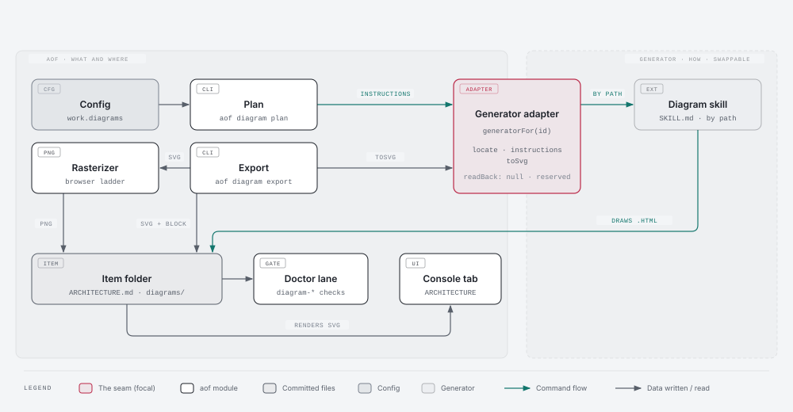

<!--
  Milestone ARCHITECTURE.md — answers ONE question: what did we decide, and why?
  Owner: architect. ADRs are append-only; a superseded decision is marked, never deleted.
  Structural invariants belong here as FITNESS FUNCTIONS (the register at the foot), not in a
  task .feature — a .feature states observable behaviour over a seam, a fitness function states a
  property of the tree.
-->
# 133 · Architecture diagrams — Architecture

The SPEC fixed the thesis: an ADR with moving parts carries a diagram, the diagram is committed next
to `ARCHITECTURE.md` with SVG and PNG exports, the console shows it, and the generator is a config
choice behind a thin seam. These ADRs decide HOW, and they answer the four questions STATE left open
for refine: the config shape and its default (ADR-001), how a driven session gets past the plugin's
style gate (ADR-002 §4, ADR-009), how PNG export runs without `npx playwright` (ADR-005), and which
file the console treats as canonical (ADR-007 §1). Where a value is a default it is marked DEFAULT
DECISION with its reason, because contracts are authored after this document and never re-opened
for it.

## Memory recall — what was surfaced, and what it changed

`aof work memory recall … --item 133 --block` and `… --area architecture --block`, run before the
ADRs. Each record honoured or departed from in writing.

- **`05/ADR-001`** (*memory is a backend selected by config; the local backend is a derived
  index, never a second source of truth*) → **HONOURED as the shape.** The generator is selected by
  `work.diagrams.generator`, resolved through ONE registry. The committed SVG/PNG are derived from
  the committed source and never edited by hand (ADR-003 §4).
- **`33/ADR-001`** (*the pluggable seam is ONE narrow resolver; one backend shipped, the others a
  later-story refusal*) → **HONOURED.** One adapter ships (`diagram-design`). An unknown generator
  id is a config ERROR that names the registered ids. It is never a silent fallback (ADR-001 §3).
- **`08/ADR-002`** (*the command core is a registry of pure operations keyed by id, each with a
  frozen `{ id, input, run, cli }` contract*) → **HONOURED.** `diagram:plan` and `diagram:export`
  are registry commands in their own family (ADR-004). Neither is a CLI ladder branch.
- **`15/ADR-006`** (*a foundation spine, pluggable groups, a keystone*) → **HONOURED as the
  partition shape.** Story 01 is the spine. Export, gates, console and prose are four stories that
  compose it, and story 06 is the live proof (ADR-010).

## Measured facts this document reasons from

Measured 2026-09-22 on `615678a` plus the uncommitted 130/132 work. Graph `aof graph build .`
rebuilt (not unchanged) at 17,303 nodes / 42,897 edges, built `2026-09-22T22:00:54Z`, egress none.
Cited as actual structure, not inference.

| claim | value | source |
|---|---|---|
| the plugin is NOT enabled for this repo | `enabledPlugins` in `.claude/settings.json` lists only the three `pm-*` plugins. The SPEC's "enabled in `.claude/settings.json`" is wrong. | `.claude/settings.json:79-83` |
| where the plugin is installed | `installed_plugins.json` has ONE `diagram-design@diagram-design` entry: `scope: "project"` for another repository on this machine, v2.6.27, `installPath` under `~/.claude/plugins/cache/diagram-design/diagram-design/2.6.27`. The marketplace clone is at `~/.claude/plugins/marketplaces/diagram-design`. | `~/.claude/plugins/installed_plugins.json` |
| the skill is plain files | `skills/diagram-design/SKILL.md` (578 lines) plus `references/*.md`. Anything that can `Read` a path can follow it, whether or not Claude Code loaded the plugin in the session. | plugin tree |
| the architect agent has no `Skill` tool | its tools are pinned to `Read, Grep, Glob, Bash, Write, Edit` by the frozen set | `src/bundle/frozen-set.jsonc:12` |
| the style gate | §0 of `SKILL.md`: a valid project `.diagram-design` marker (`profile: <slug>`) bypasses the gate. With no marker and an unedited `style-guide.md`, the skill PAUSES for onboarding. There is no `.diagram-design` in this repo. `~/.diagram-design/profiles/` holds `default` and two other projects' profiles. | `SKILL.md:18-26`; `references/profiles.md` |
| the plugin's SVG export is text | take the first `<svg>…</svg>`, ensure `xmlns` and `viewBox`, merge a font `@import` into `<defs>` with `&` escaped, rewrite `rgba()` fill/stroke to hex plus opacity, prepend an XML prolog | `references/export.md` §SVG export procedure |
| the plugin's PNG export needs Python Playwright | `python -c "import playwright"`, then a sync_playwright element screenshot. On a miss it stops and does not install. `npx playwright` is policy-blocked on this machine (memory `design-render-headless-chromium`). | `references/export.md` §PNG |
| PNG without Playwright works (measured) | The extracted SVG of `example-architecture.html` (viewBox `0 0 1000 480`) was rendered by the cached `chrome-headless-shell` with `--window-size=1000,480 --force-device-scale-factor=2 --screenshot=<abs fwd-slash path> file:///…svg` and an isolated `--user-data-dir`. It wrote a 2000×960 PNG in 0.85 s and exited only after the write. Edge (`--headless=new`, isolated profile) wrote the same image but its launcher RETURNED in 0.07 s, BEFORE the file existed. The PNG is colour type 2 (RGB): `--default-background-color=00000000` did not give transparency. | scratchpad run 2026-09-22 |
| browsers present here | `%LOCALAPPDATA%/ms-playwright/chromium_headless_shell-{1169…1234}`, Chrome at `Program Files/Google/Chrome`, Edge at `Program Files (x86)/Microsoft/Edge` | `ls` |
| the config idiom to extend | `validateWorkPlan(work.plan, diagnostics)` is called from the work validator. `planEnabled(config)` is the ONE reader (`config?.work?.plan?.enabled === true`). | `src/config-inspect.mjs:1200-1229` |
| the artifact manifest already has a directory kind | `{ name, dir, ext }` is requested by NAME plus MEMBER and streamed by the worker. `TASKS` (`tasks/*.feature`) is its only member. `artifactForRelativePath` is the membership test. | `src/work/artifacts.mjs:27-49`, `:74-90` |
| the doc route drops the member | `/api/work/doc` passes `{ ref, doc }` to `work:doc` and never reads a `member` param | `src/board-ui.mjs:106-113` |
| the board has NO architecture surface | milestone tabs are `SPEC, VERIFICATION, RETROSPECTIVE, RUNS, FINDINGS`. `DocName` is `SPEC \| STORY \| VERIFICATION \| RETROSPECTIVE`. `api.doc(ref, doc)` takes no member. | `ui/src/board/DetailPanel.tsx:42-47`; `ui/src/board/api.ts:77`, `:250` |
| the board's markdown is unsanitised by design | `marked.parse` → `dangerouslySetInnerHTML`, justified as trusted local same-origin docs. A relative `` resolves against the board URL, so it is a broken image today. | `ui/src/board/Markdown.tsx:1-30` |
| a worker streams via the manifest | the PostToolUse enqueue fires on `Write\|Edit`. A file written by a CLI is picked up by the reconciliation tick over the same manifest. | `.claude/hooks/aof/artifact-sync-enqueue.mjs:1-40` |
| doctor lanes are a NAMED family | `CHECK_GROUPS` is appended to. `DOCTOR_LANE_MODULES` names each `./doctor-*.mjs` lane ("a ninth arriving is an edit here"). `DOCTOR_FAMILY = "src/work/doctor"` is a path prefix. | `src/work/doctor.mjs:814`; `test/arch/audit/acd-controls-never-execute.test.mjs:98-110` |
| the placement budgets | `src/` 92 root modules, allowance 0. `src/commands/` counts FILES (69, allowance 0), so a new family DIRECTORY is free there but owes its own row or exemption. The `src/commands/work/` row says "the next file here is the fold or nothing". `src/work/` is at 43/43. `FLAT_LAYER_THRESHOLD = 8`: a layer at or under 8 may be a declared exemption. | `test/arch/testing/acd-source-directory-budget.test.mjs:62-77`, `:102-171`, `:584-612` |
| test headroom | one slot each in `test/arch/work` 48/49, `test/arch/ui` 33/34, `test/ui` 56/57, `test/work` 57/58 | `ls` + the budget table |
| coupling | `src/work/artifacts.mjs` ← 5 src (`artifact-sync`, `cache-read`, `commands/doc`, `global-work-store`, `work/content-read`), 0 deps. `src/config-inspect.mjs` ← 6 src / 19 total. `src/work/doctor.mjs` ← 4 src / 30 total. `DetailPanel.tsx` ← `Board.tsx` only. `Markdown.tsx` ← `DetailPanel.tsx` only. `src/commands/doc.mjs` ← `command-core` only. | `aof graph impact` |

---

## ADR-001 — `work.diagrams` names the generator; absent means off

### Context

The SPEC asks for a generator named in config, an explicit off switch, and a stated default for
projects that say nothing. aof is installed into projects that do not have the `diagram-design`
plugin. This one does not have it enabled either (measured). A default of "on" would make every
governed project's refine try to draw with a tool it cannot reach.

### Decision

1. **Shape.** `work.diagrams` in `.aof/aof.config.json`, validated in `src/config-inspect.mjs`
   by `validateWorkDiagrams(work.diagrams, diagnostics)`, called beside `validateWorkPlan`:

   ```json
   "diagrams": {
     "generator": "diagram-design",
     "formats": ["svg", "png"],
     "style": ".aof/diagrams/style.md",
     "browser": null
   }
   ```

   - `generator` (required when the object is present): a registered generator id, or `"off"`.
   - `formats` (optional; DEFAULT DECISION `["svg", "png"]`, the SPEC's pair): a subset of
     `svg`/`png` that MUST contain `svg`, because the console reads the SVG (ADR-007 §1).
   - `style` (optional): a project-root-relative path to a style file in the generator's own format
     (ADR-002 §4). aof only checks that the file exists. It never reads its contents.
   - `browser` (optional): the absolute path of a Chromium-family executable for PNG export. It is
     the first rung of ADR-005 §3's ladder.
2. **Default. DEFAULT DECISION: an absent `work.diagrams` is OFF.** Existing projects are unchanged,
   and a project opts in by writing the key. This repo opts in at story 06 (ADR-009). The reason is
   that the one shipped generator is a user-level Claude Code plugin that aof cannot assume and does
   not install (SPEC out of scope).
3. **One reader.** `resolveWorkDiagrams(config)` in `src/config-inspect.mjs` (the `planEnabled`
   idiom) returns a frozen `{ enabled, generator, formats, style, browser }`, and every consumer
   reads through it. `enabled` is false when the key is absent or `generator === "off"`. An unknown
   generator id is a config ERROR that lists the registered ids plus `off`. It never falls back.
   The id list comes from the registry (ADR-002 §1), so `config-inspect.mjs` never spells a
   generator's name (FF-13301). `schemas/aof.schema.json` gains the same object.

### Alternatives considered

- **Default on, generator `diagram-design`.** Rejected, because every project without the plugin
  would see a refine step that cannot run.
- **A boolean `work.diagrams.enabled` plus a separate generator key.** Rejected, because it has two
  keys for one decision and adds a fourth state (enabled with no generator). `generator: "off"` is
  the off switch the SPEC asks for.

### Consequences

Turning diagrams off, or on, is a one-value config edit, with no bundle edit (ADR-008 §1). A second
generator adds one registry entry and makes one more id legal. The config shape does not change.

## ADR-002 — The generator seam is one adapter behind one registry

### Context

The SPEC splits ownership. aof owns WHAT is drawn (the brief), WHERE it lives and its NAME. The
generator owns HOW it is drawn and exported. It also reserves a read-back direction. Measured: the
architect has no `Skill` tool (frozen set). Codex and OpenCode renderings of the bundle have no
Claude plugins at all. The skill is plain markdown on disk.

### Decision

1. **Registry.** `src/diagrams/generators.mjs` exports `generatorIds()` and `generatorFor(id)` over
   a frozen map built from each adapter's own `id`. `src/diagrams/generator-diagram-design.mjs` is
   the one adapter, and the literal `diagram-design` is spelled in that file and nowhere else under
   `src/` (FF-13301).
2. **The adapter contract**, a frozen object:
   `{ id, sourceExt, locate({ home }), instructions({ brief, paths, style, skill }), toSvg(sourceText), readBack: null }`.
   - `locate` → `{ ok: true, skill: <absolute SKILL.md path> }` or
     `{ ok: false, code: "diagram-generator-missing", fix }`. For `diagram-design` it reads
     `<home>/.claude/plugins/installed_plugins.json`, takes every `diagram-design@diagram-design`
     entry of ANY scope, and uses the newest by `lastUpdated` whose
     `<installPath>/skills/diagram-design/SKILL.md` exists. It then falls back to the marketplace
     clone's `skills/diagram-design/SKILL.md`. The `fix` names the two `/plugin` commands. aof runs
     neither.
   - `instructions` returns the text the drawing agent follows. For `diagram-design` that text is:
     Read the skill at `<skill>` and follow it. The effective style guide is `<style>`, so skip §0
     and profile resolution (with no `style`, use the shipped guide as-is and skip §0). The reader
     is not reachable, so do not pause to confirm and note assumptions beside the brief. Draw
     exactly one static diagram for `<brief>`. Write the self-contained HTML to `<paths.source>`
     and write nothing else. Do not export.
   - `toSvg` is the plugin's documented SVG procedure, done in Node (ADR-005 §1).
   - `readBack: null` is the reserved read-back direction. It is a key that exists and holds null,
     so a later item fills it without changing the contract's shape.
3. **Invocation is by path, not by the Skill tool.** Any runtime and any agent with `Read` can
   follow a skill at an absolute path, whether or not the plugin is enabled for the project. The
   measured install (project-scoped to a different repo) works as-is.
4. **The style gate is pre-empted by the instructions, not by a marker.** The effective style is
   whatever `work.diagrams.style` names, handed over in the instructions (§2). aof writes no
   `.diagram-design` marker and writes nothing under `~/.diagram-design/`. A committed style file
   travels to every node and every worktree lane. A home-directory profile does not.

### Alternatives considered

- **Add `Skill` to the architect's tools.** Rejected, because it edits the frozen set, works only
  on Claude Code, and needs the plugin enabled per project.
- **A committed `.diagram-design` marker plus a synced home profile.** Rejected, because it makes aof
  write into another tool's home directory, and the profile must exist on every worker node.

### Consequences

The architect prompt names aof's verbs and never the generator (ADR-008). Swapping the generator is
one config value plus one adapter file.

### Diagram

This seam has moving parts on both sides of a boundary, and the prose above makes the reader
assemble them. Draw it as an architecture view. Components: the config (`work.diagrams`), the
registry, the adapter (`locate`, `instructions`, `toSvg`, `readBack` reserved), `diagram:plan`,
`diagram:export`, the rasterizer and its browser ladder, the item's `diagrams/` folder,
`ARCHITECTURE.md`, the doctor lane, and the console tab. Flows: config → plan → instructions → the
architect draws the source → export → SVG → PNG → block pasted → doctor checks → console renders the
SVG. The focal node is the adapter boundary, with aof's side on the left and the generator's on the
right. Story 06 draws it through the seam itself (ADR-009 §3).



Source: [ADR-002-generator-seam.html](diagrams/ADR-002-generator-seam.html) · PNG: [ADR-002-generator-seam.png](diagrams/ADR-002-generator-seam.png)

## ADR-003 — The diagram lives in the item folder, named by its ADR

### Context

The SPEC places the diagram inside the milestone folder next to `ARCHITECTURE.md` and links it from
the ADR. ADRs are immutable, so the diagram is too. The writer (`plan`/`export`), the reader (the
doctor lane) and the console must agree on names and link spelling.

### Decision

1. **Layout.** `<itemDir>/diagrams/<stem>.{<sourceExt>,svg,png}` with the stem grammar
   `ADR-<NNN>-<slug>`, where `NNN` is the ADR's own three digits and `slug` matches
   `[a-z0-9][a-z0-9-]{0,47}`. `src/diagrams/layout.mjs` is the ONE home of the directory literal,
   the stem grammar, `diagramPaths(itemDir, stem, sourceExt, formats)`, the brief reader, the
   link-block writer and the link parser (FF-13302).
2. **The brief is part of the ADR.** An ADR that gets a diagram carries a `### Diagram` subsection.
   Its prose, before any image link, is the brief: why a picture helps, the view (architecture,
   sequence, state machine…), the components and the flows. `readDiagramBrief(markdown, adrId)`
   returns it, or null. The brief is committed with the ADR, so what was asked for stays reviewable
   and the future read-back has something to compare against.
3. **The link block.** `renderDiagramBlock({ adrId, title, stem, sourceExt, formats })` writes:

   ```markdown
   

   Source: [ADR-002-generator-seam.html](diagrams/ADR-002-generator-seam.html) · PNG: [ADR-002-generator-seam.png](diagrams/ADR-002-generator-seam.png)
   ```

   `parseDiagramLinks(markdown)` returns every link or image target under `diagrams/`, with the ADR
   section it sits in (`## ADR-NNN` heading) and its line number. The architect pastes the block that
   `diagram:export` returns. aof never edits `ARCHITECTURE.md`, because the architect is its single
   writer.
4. **Immutability.** The source is the editable artifact. The SVG and PNG are derived from it and
   never edited by hand. While the item is open, re-planning or re-exporting overwrites, because
   drawing is iterative inside the authoring beat. On a `done` item both verbs refuse with
   `diagram-item-delivered`. A changed design is a new ADR with a new stem.

### Alternatives considered

- **A central `wiki/diagrams/` store.** Rejected, because the SPEC puts the diagram with its ADR and
  a separate store would be a second home for the record.
- **Having `export` insert the block into `ARCHITECTURE.md` itself.** Rejected, because it gives the
  document a second writer. The doctor lane catches a block that was pasted wrong (ADR-006).

## ADR-004 — Two registry commands in a `diagram` family

### Context

The architect needs two things aof must answer at run time: whether diagrams are on and how to draw
(which depends on config), and turning the drawn source into committed exports. `src/commands/`
refuses a new flat file. `src/commands/work/` admits "the fold or nothing".

### Decision

1. **Family.** `src/commands/diagram/plan.mjs` (`diagram:plan`) and
   `src/commands/diagram/export.mjs` (`diagram:export`), registered in the command core like the
   `graph:*` family (`src/commands/graph/build.mjs:106`). The directory is a declared EXEMPTION in
   the source-directory budget (two members, under `FLAT_LAYER_THRESHOLD`), written once by story
   01 and naming both members. An exemption rather than a row, so stories 01 and 02 do not each edit
   a ceiling (129's `src/loop` precedent). The engine is the `src/diagrams/` family (layout,
   generators, rasterize), which is exempt on the same terms.
2. **`aof diagram plan <ref> <ADR-NNN> --slug <slug> [--json]`** answers:
   - off → `{ enabled: false, reason }`, exit 0. The prose branches on it (ADR-008).
   - generator not found → `{ enabled: true, available: false, code: "diagram-generator-missing", fix }`,
     exit 0. It is an answer for the prose to act on, not a failure of the command.
   - otherwise `{ enabled: true, available: true, generator, item, adr, stem, paths, brief, instructions }`.
     `paths` are project-root-relative with forward slashes. `instructions` repeat the paths as
     absolute paths for the drawing agent.
   - coded refusals, non-zero: `ref-not-found`; `diagram-adr-invalid` (not `ADR-NNN`);
     `diagram-adr-unknown` (no such `## ADR-NNN` heading in the item's `ARCHITECTURE.md`);
     `diagram-brief-missing` (no `### Diagram` brief in that ADR); `diagram-slug-invalid`;
     `diagram-style-missing` (`style` names a file that does not exist); `diagram-item-delivered`.
3. **`aof diagram export <ref> <ADR-NNN> [--json]`** finds exactly one `diagrams/ADR-NNN-*.<sourceExt>`
   (`diagram-source-missing` when there is none, `diagram-source-ambiguous` when there are several),
   writes the SVG, then the PNG when `formats` includes it, and returns `{ written, block }` (ADR-005).
   When diagrams are off it refuses with `diagram-disabled`.

### Alternatives considered

- **`aof work diagram`.** Rejected because of placement. `src/commands/work/` refuses a lone second
  member, and the work-verb fold is its own item. The verbs are keyed by item ref, but the subject
  is drawing, like `graph`.
- **No CLI, with the prose reading config itself.** Rejected, because the prose would then have to
  know how to locate and invoke the generator, which is exactly what the seam keeps out of it.

## ADR-005 — Export: the adapter makes the SVG, aof rasterizes the PNG

### Context

The plugin's PNG path needs Python Playwright, which is blocked here, absent from worker nodes, and
auto-installed by nothing. The measurement above shows a cached headless shell, Chrome or Edge can
rasterize the extracted SVG directly.

### Decision

1. **SVG.** The adapter's `toSvg` follows `references/export.md` in Node. It takes the first
   `<svg>…</svg>` (`diagram-source-no-svg` if there is none), ensures `xmlns`, requires `viewBox`
   (`diagram-svg-no-viewbox`), merges the source's own Google Fonts `<link href>` into `<defs>` as
   an `@import` with `&` escaped as `&amp;`, rewrites `rgba()` fill/stroke to hex plus
   `*-opacity`, and prepends the XML prolog. The export writes it as `<stem>.svg`.
2. **PNG** is generic and generator-agnostic: `rasterizeSvg({ svgPath, pngPath, scale: 2, browser })`
   in `src/diagrams/rasterize.mjs` renders the COMMITTED SVG, never the HTML, at
   `--window-size=<viewBox w>,<viewBox h>` and `--force-device-scale-factor=2`, with an isolated
   temporary `--user-data-dir` that is removed afterwards and an absolute forward-slash
   `--screenshot` path. It is done when the process has exited AND the output file exists and is
   non-empty. That file poll is required because Edge's launcher returns before writing (measured).
   After 30 s it gives up with `diagram-png-render-timeout`. Transparency is not promised: the
   diagram carries its own paper colour, and the measured output is RGB.
3. **Browser ladder** (first hit wins): `work.diagrams.browser`, then `AOF_DIAGRAM_BROWSER`, then the
   newest cached `ms-playwright/chromium_headless_shell-*` (the per-OS cache root), then Chrome, then
   Edge at their standard install paths, then `chromium`, `chromium-browser` or `google-chrome` on
   `PATH`. A full browser gets `--headless=new`. No rung ever downloads anything. A miss is
   `diagram-png-renderer-missing`, and its `fix` names the config key and the env var.
4. **A PNG failure never loses the SVG.** The SVG is written first. A PNG miss leaves the SVG in
   place, exits non-zero with the code, and the doctor lane reports the missing export until it is
   fixed (ADR-006).
5. The rasterizer imports no `playwright`, and nothing under `src/diagrams/` spawns `npx` or
   `python`. The browser argv is formed in ONE function (FF-13303).

### Alternatives considered

- **Delegate to `/diagram-design:export-diagram`.** Rejected, because it needs Python Playwright,
  which is blocked here and absent on the nodes.
- **Drive Chromium over CDP with `ws`** (the memory's interactive recipe). Rejected for now: an
  element screenshot is not needed once the window IS the viewBox. CDP remains the fallback if a
  generator's SVG needs layout before capture.

## ADR-006 — The doctor lane checks links and exports

### Context

The SPEC asks validate/doctor to catch a linked diagram missing from the tree, and an ADR that links
a diagram with no committed export. Doctor lanes are a named family under `src/work/doctor-*`
(FF-5905).

### Decision

1. **Lane.** `src/work/doctor-diagrams.mjs` exports `diagramsGroup(snapshot, ctx)`, appended to
   `CHECK_GROUPS` and named in `DOCTOR_LANE_MODULES`. The `src/work/` row rises 43 → 44 with its
   reason stated. The lane reads each in-scope item's `ARCHITECTURE.md` and its `diagrams/`
   listing from the local tree, and parses through `src/diagrams/layout.mjs` alone (FF-13302).
2. **Codes.**

   | code | severity | fires when |
   |---|---|---|
   | `diagram-link-missing` | error | a `diagrams/…` link or image target is not in the tree |
   | `diagram-export-missing` | error | a linked stem has no `.svg`, or no `.png` while `formats` includes png |
   | `diagram-adr-mismatch` | error | a link's stem names a different ADR from the section it sits in |
   | `diagram-orphan` | warn | a file in `diagrams/` that no link names |

   The lane runs whether `work.diagrams` is on or off, because a committed link is a link either
   way. When diagrams are off, only the SVG is owed. An item this node does not hold on disk is
   skipped rather than reported. The codes are disjoint from every other lane's.

### Consequences

An `error` here fails `aof:validate` like any doctor error. A PNG that could not be rendered on one
node keeps the item red until it is exported where a browser exists.

## ADR-007 — The console shows the SVG as an image in a new ARCHITECTURE tab

### Context

Measured: the board has no architecture surface at all. Its markdown is rendered unsanitised, and a
relative image is a broken link. A worker-authored diagram has to reach the control node the same
way every other record does.

### Decision

1. **The SVG is canonical for the console.** The HTML source needs fonts and a browser frame, and
   the PNG is binary. The SVG is text, so it rides the manifest.
2. **Manifest.** `WORK_ITEM_ARTIFACTS` gains `{ name: "DIAGRAMS", dir: "diagrams", ext: ".svg" }`.
   `work:doc <ref> DIAGRAMS <member>` is then requestable, the worker streams it, and the cache
   holds it, through the path `TASKS` already uses. No new route and no new reader.
   `/api/work/doc` forwards a `member` param to `work:doc`, the one-line fix to the dropped param.
3. **Surface.** A milestone's tabs become `SPEC, ARCHITECTURE, VERIFICATION, RETROSPECTIVE, RUNS,
   FINDINGS`. `DocName` gains `ARCHITECTURE` and `api.doc` takes an optional member. The layout is
   in DESIGN.md.
4. **Rendering: image only.** For the ARCHITECTURE tab, the panel collects each image `src` of the
   form `diagrams/<member>.svg`, fetches it as `DIAGRAMS/<member>`, and hands `Markdown` a map from
   `src` to a `data:image/svg+xml;charset=utf-8,<encodeURIComponent(body)>` URI. `Markdown` gains an
   optional `images` prop and uses it in a `marked` image renderer. A diagram src that is not in the
   map renders the absent figure (DESIGN). The SVG body is never put into the DOM as markup. An
   `` runs no script and loads no sub-resources, so typography falls back to local fonts in
   the console, which is accepted. The unsanitised-markdown trust model stays true because the SVG
   never passes through it (FF-13304).
5. **Placement.** `DetailPanel.tsx` has 7 lines of headroom, so the collection, fetch and data-URI
   logic lives in a new `ui/src/board/diagrams.mjs` (pure, node-testable) with its `.d.mts`,
   following the pair idiom of `action`, `freshness` and `runs`. `DetailPanel` gains only the
   tab, the Records row and one call into it. The `board` row of `acd-ui-directory-budget` rises
   22 → 24 with that reason, because the per-file ceiling forces a sibling. Every `ui/` change
   re-pins FF-5307's tree digest (`acd-loop-state-rides-the-run-record`) with the measured diff
   stated.
6. **Amended at `aof:verify 133` (2026-09-23, VERIFICATION F-133-01/02), while the item was open.**
   (a) A populated figure is a button, and the panel presents a full-size viewer over the SAME data-URI
   `` as the SHELL's fullscreen occupant (`requestFullscreen`, 45/ADR-005), so §4's image-only
   line holds and no surface paints its own layer. (b) The block's `Source · PNG` links are served by a
   third verb of ADR-004's family, `diagram:file` (`src/commands/diagram/file.mjs`). It reads a
   committed `diagrams/` file from this node's checkout only, and checks the name with the layout's
   `diagramFile` grammar (FF-13302) before any read. The board serves it at `/api/diagram/file`,
   outside `/api/work`, because that namespace is in bijection with the `work:*` commands
   (15/ADR-005). It is wired by one additive line in `setup-ui.mjs`, and every answer carries
   `Content-Security-Policy: sandbox`, so the generator's HTML opens in an opaque origin with no
   script. §2 is unchanged: the manifest and the worker stream still carry the SVG alone.

### Alternatives considered

- **Inline the SVG markup.** Rejected, because a generator's output would be placed into an
  unsanitised `innerHTML`.
- **A new raw-file route that serves `image/svg+xml`.** Rejected, because the manifest already makes
  the file requestable, streamed and cached, and a second route would be a second reader.

## ADR-008 — The architect draws, told how by the CLI

### Context

The SPEC says the architect draws at refine, decides whether an ADR needs a diagram, and states
that judgement in the ADR. Changing config must change what refine does with no bundle edit.

### Decision

1. **Prose surface.** `src/bundle/agents/aof-architect.md` (the architect's ADR rule) and the Decide
   step of `src/bundle/commands/refine.md` gain ONE diagram step, extending the ADR authoring they
   already describe:
   - After writing an ADR whose design has moving parts, write its `### Diagram` brief. The
     judgement is the architect's and the brief states why. Most ADRs get none.
   - Run `aof diagram plan <ref> <ADR-NNN> --slug <slug> --json`. `enabled: false` → drop the
     brief and move on, with nothing recorded. `available: false` → keep the brief, record
     `diagram not drawn: <code>` in `STATE.md`, and continue. This is never a stop. Otherwise
     follow `instructions`.
   - Run `aof diagram export <ref> <ADR-NNN> --json` and paste the returned `block` under the brief.
   - On a solo refine the main session is the architect and runs the same step.
2. The prose names `aof diagram plan` and `aof diagram export` and never names a generator
   (FF-13301 sweeps `src/bundle/**`). The rendered `.claude/` copies are regenerated by
   `aof work update` in the same story.

## ADR-009 — This repo draws in the console's own style

### Context

The operator asked for an aof profile built from the frontend's design scheme (refine, 2026-09-22).
Its tokens are in `ui/src/index.css:3-25`: primary teal `hsl(174 72% 27%)`, accent crimson
`hsl(347 66% 44%)`, background `hsl(210 18% 96%)`, foreground `hsl(220 18% 13%)`, border
`hsl(214 16% 78%)`, muted foreground `hsl(218 9% 38%)`, radius `0.5rem`.

### Decision

1. **`.aof/diagrams/style.md`** is a complete `diagram-design` style guide, in the structure of the
   plugin's `references/style-guide.md` (semantic roles, typography, stroke/radius/spacing, node
   treatments). Its values map the UI's tokens: `accent` is the focal role, with the UI's primary
   teal as the diagram's structural accent. Its fonts are the UI's own stack. It carries the
   plugin's light→dark inversion rule.
2. **This repo opts in:** `work.diagrams = { generator: "diagram-design", formats: ["svg","png"],
   style: ".aof/diagrams/style.md" }`. Both edits are under `.aof/`, which a loop lane's reconcile
   resets before committing (memory `lane-commits-drop-aof-config`), so story 06 commits them BY
   HAND on its branch.
3. **The live proof draws this milestone's own seam.** ADR-002 is the design with moving parts
   (registry, adapter, config, the two verbs, the rasterizer), and its `### Diagram` brief is
   already written in its own section.
   Story 06 runs the real step on it and pastes the block. That appends to the ADR the link its own
   brief asks for. The decision is not changed.

## ADR-010 — Six stories: a spine, four stories that compose it, a live proof

The graph-derived coupling decides the cuts. `artifacts.mjs` (5 src dependents) and the board
(`DetailPanel` ← `Board` only) have no edge to config, layout or doctor, so the console story is
independent of the spine and runs in stage 1. `doctor.mjs` (4 src dependents) is touched only by
story 03. `config-inspect.mjs` (6 src dependents) is touched only by story 01.

| story | writes | depends | stage |
|---|---|---|---|
| 01 the seam | `src/config-inspect.mjs`, `schemas/aof.schema.json`, `src/diagrams/{layout,generators,generator-diagram-design}.mjs`, `src/commands/diagram/plan.mjs`, `src/command-core.mjs`, `src/cli.mjs` (the family's help and fallback), the budget exemptions, `test/diagrams/` + `test/arch/diagrams/` with their indexes and runner registration, FF-13301/13302 | — | 1 |
| 04 the console | `src/work/artifacts.mjs`, `src/board-ui.mjs`, `ui/src/board/{api.ts,DetailPanel.tsx,Markdown.tsx}`, the new `ui/src/board/diagrams.{mjs,d.mts}` pair, the `board` row 22 → 24, FF-5307's re-pin, the manifest suites, FF-13304/13305 | — | 1 |
| 02 export | `src/diagrams/rasterize.mjs`, `src/commands/diagram/export.mjs`, its `command-core` registration, FF-13303 | 01 | 2 |
| 03 the gates | `src/work/doctor-diagrams.mjs`, `src/work/doctor.mjs`, its suite in `test/work/`, the `src/work` row, the lane roster | 01 | 2 |
| 05 the prose | `src/bundle/agents/aof-architect.md`, `src/bundle/commands/refine.md`, the bundle manifest, the six rendered copies (`.claude`, `.codex`, `.opencode`) | 01, 02 | 3 |
| 06 the live draw | `.aof/diagrams/style.md`, `.aof/aof.config.json`, ADR-002's block and its `diagrams/` files | 01–05 | 4 |

Stories 02 and 03 are write-disjoint. Story 03's lane suite joins its sibling lane suites in
`test/work/` (`doctor-*-lane.test.mjs`), which takes that directory's one free slot, so only
story 02 appends to the `test/diagrams/` indexes that story 01 founds. Stories 01 and 02 both
register a command in `src/command-core.mjs`, and 02 depends on 01, so they never run at the same
time. Measured budget pressure the stories inherit: `DetailPanel.tsx` is 993 of its 1,000-line
ceiling, and `ui/src/board/` is 22 of 22 files (ADR-007 §5).

## Fitness functions

HARNESS SHAPE (`119/ADR-010`): each arch-test exports `archTests`, an array of `{ name, run }`,
registered by one import + one spread in its directory's `index.mjs`. Every control below is
`pending` until its story lands it, and each landed control owes a red probe in `VERIFICATION.md`.
The standing controls this milestone must keep green are cited, not redeclared:
`acd-source-directory-budget` (rows and exemptions changed by 01 and 03), `acd-controls-never-execute`
(FF-5905's lane roster, extended by 03), `acd-work-artifact-set-single-home` (FF-7008, extended by
04), `acd-no-new-silent-catch`, `acd-console-log-confined`, `acd-ui-surface-file-budget`.

| id | invariant | enforced by (arch-test) | from |
|---|---|---|---|
| FF-13301 | **The generator is named once.** In a comment-stripped sweep of `src/**` (including `src/bundle/**`), the literal `diagram-design` appears only in `src/diagrams/generator-diagram-design.mjs`. `src/config-inspect.mjs` takes generator ids from `generatorIds()`, and the registry map is built from adapter `id`s. Every registered adapter carries the six contract keys, and `readBack` is present. | `test/arch/diagrams/acd-diagram-generator-named-once.test.mjs` | ADR-001 §3, ADR-002, ADR-008 §2 |
| FF-13302 | **The layout has one home.** Outside `src/diagrams/layout.mjs`, no `src/**` module spells the `ADR-\d{3}-` stem pattern or builds a `"diagrams/"` path. Every `src/**` module that reads or writes a diagram path imports the layout by resolved specifier. That includes `src/commands/diagram/*.mjs` and `src/work/doctor-diagrams.mjs`, each checked once the file exists. `src/work/artifacts.mjs`'s manifest entry (`dir: "diagrams"`, ADR-007 §2) is the one named exception, because the manifest is its own single home (FF-7008). A round trip `parseDiagramLinks(renderDiagramBlock(x))` gives back every target it wrote. | `test/arch/diagrams/acd-diagram-layout-single-home.test.mjs` | ADR-003, ADR-006 §1 |
| FF-13303 | **Export needs no Playwright and forms one argv.** `src/diagrams/**` and `src/commands/diagram/**` import no `playwright` and spawn no `npx` or `python`. `src/diagrams/rasterize.mjs` has exactly ONE function that returns a browser argv, and every spawn in the file uses it. No rung of the ladder downloads anything. | `test/arch/diagrams/acd-diagram-export-no-playwright.test.mjs` | ADR-005 §3, §5 |
| FF-13304 | **The console renders a diagram only as an image.** In `ui/src/board/**`, a `DIAGRAMS` doc body reaches the page only through `encodeURIComponent` into a `data:image/svg+xml` URI in an image `src`. It is never passed to `marked.parse`, `dangerouslySetInnerHTML` or `innerHTML`. `api.doc` is the only fetch of `DIAGRAMS`. | `test/arch/ui/acd-diagram-rendered-as-image.test.mjs` | ADR-007 §4 |
| FF-13305 | **Diagrams ride the one manifest.** `WORK_ITEM_ARTIFACTS` holds exactly one entry with `dir: "diagrams"`, and it is `{ name: "DIAGRAMS", dir: "diagrams", ext: ".svg" }`. `artifactForRelativePath("diagrams/ADR-002-x.svg")` returns it, and `.html`, `.png` and nested paths return null. | `test/arch/work/acd-work-artifact-set-single-home.test.mjs` (the leg story 04 extends) | ADR-007 §2 |
