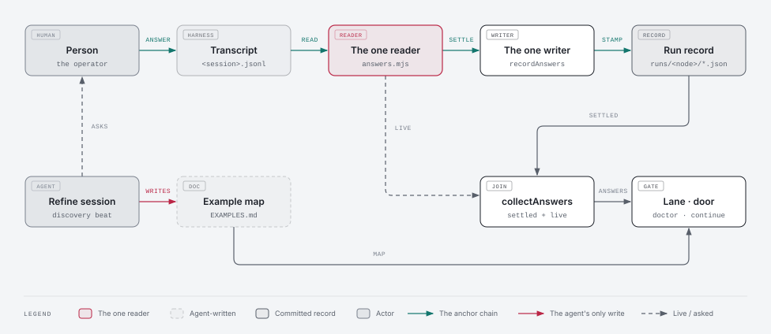

# 134 · Discovery before formulation — Architecture

STATE lists five things this document must settle, in order: where the map lives and its budget
(ADR-001); the provenance anchor (ADR-003); who classifies business versus technical (ADR-004); the
doctor finding ids and severities (ADR-005); the config key and its off-path guarantee (ADR-006,
which also covers `--autonomous`). ADR-002 places the new modules, and ADR-007 is the break-down.

## Memory recall: what was surfaced, and what it changed

- **55/ADR-003**: "Provenance is a frozen envelope, stamped by ONE writer seam at write time … a
  claim that arrives without one is refused, never back-filled." **Honoured.** The answer record is
  stamped once, by `run-store.mjs`, from what the harness wrote (ADR-003). A `stated` or
  `confirmed` label with no stamp behind it is refused, not inferred.
- **63/ADR-013**: "The transcript watch is SESSION-SHAPED." **Honoured.** The anchor joins on the
  run record's `sessionId` and nothing else (RESEARCH R4).
- **69/ADR-007**: "A run waiting on a human releases its slot." **Deferred to 136.** It belongs to
  the loop-driven path, not here.
- The PO recall for the milestone domain came back empty.

## Measured facts this document reasons from

| Fact | Where |
|---|---|
| The harness writes `toolUseResult.answers` keyed by question text. 46 answered and 8 refused out of 54 calls. 0 calls from a subagent. | RESEARCH R1, R2 |
| The record names the channel (`userType`, `entrypoint`, `sessionId`), not the person | RESEARCH R3 |
| A phase's run record already carries the session id | RESEARCH R4; `src/commands/run-start.mjs:104` |
| The settle seam passes the repository root as the transcript directory, so spend is never stamped on a hand-run settle | RESEARCH R5; `src/effects/run-transitions.mjs:113` |
| The optional-document precedent: a boolean gate defaulting off, resolved once, and a snapshot probe that is silent when the file is absent | `src/config-inspect.mjs:1312`; `src/work/doctor.mjs:506` |
| `src/` is at its ceiling (allowance 0). `src/work` is at 44, where a new doctor lane is the family's own growth. `test/work` and `test/arch/work` are full. | `test/arch/testing/acd-source-directory-budget.test.mjs` |
| The harness's human-input tool name already has one home | `src/agent-session-driver.mjs:337` (`HUMAN_INPUT_TOOL_NAMES`) |
| `src/bundle/manifest.json` hashes both the story templates and `refine.md` | `src/bundle/manifest.json:279`, `:612` |

## ADR-001 — The map is a sibling `EXAMPLES.md`, one screen long, in a closed grammar

### Context

Research §7 Q1 offers two homes: a `## Example map` section in `STORY.md`, or a sibling document.
`STORY.md` carries a 150-line budget, and the accept door refuses it when over. A map added to it
would compete with the user story for that budget, and a long map would block the accept.

### Decision

1. **A sibling `EXAMPLES.md` in the story folder**, written by the discovery beat before any
   `.feature`. It has its own budget kind, `examples`, with a default of **50 lines**: one screen.
   The budget lane governs it as a single row beside `PLAN.md`, with no length check of its own. A
   map past one screen is a story to split (SPEC).
2. **The grammar is closed** and parsed by one pure module, `src/work-examples/map.mjs`:

   ```markdown
   ---
   doc: examples
   ---
   # 134/02 · Example map

   ## R1 · <the rule, one sentence>
   - E1 · <real values> → <observable outcome> [proposed]
   - E2 · <real values> → <observable outcome> [confirmed]
   - E3 · <real values> → <observable outcome> [stated Q1]

   ## Questions
   - Q1 · business · answered · <the question>
   - Q2 · business · open · <the question>
   - Q3 · technical · defaulted ADR-004 · <the question>
   ```

   - Rule headings are `## R<n> · …`. Example lines are `- E<n> · … [<provenance>]`. The one
     `## Questions` section holds `- Q<n> · <class> · <state> · …`. Ids are unique within the map.
   - **Provenance is exactly three labels:** `proposed` (agent only), `confirmed` (the agent proposed
     it and a person agreed) and `stated Q<n>` (it came from the person's answer to that question).
   - **Question state is exactly four:** `open`, `asked`, `answered`, and `defaulted <pointer>`.
     The last is technical only (ADR-004).
   - **Not applicable** is a map whose body is one line, `Not applicable: <reason>.`, and has no
     rules. This is the SPEC's "declares the map not applicable in one line".
   - A line the grammar does not admit is a finding (ADR-005), never skipped. A misspelt label
     (`[confirmd]`) must not slip past the gate.
3. **`ruled` does not join the vocabulary** (research §7 Q5). An ADR is written by an agent, and
   a business rule decided by an ADR is the smuggled default this milestone exists to stop. An ADR
   may settle a *technical* question, which is what `defaulted <pointer>` records.
4. **The map is text an agent writes, and code never writes it.** Code reads it and checks its
   claims (ADR-003, ADR-005).

### Alternatives considered

- *A section in `STORY.md`.* One document at review, but it shares the 150-line accept door with
  the user story, and the lint target is a region of a file rather than a file. Rejected.
- *Map rows written by a CLI verb.* This would make code the author of the map. The label would
  still be only as good as whoever called the verb. Rejected: the answer's anchor is the harness
  record, not the writer of the map.

### Consequences

The story folder gains one optional document. Stories that predate the gate have none, and nothing
reports that (ADR-005 §3).

## ADR-002 — The work-examples family: `src/work-examples/`, `test/examples/`, `test/arch/examples/`

### Context

`src/` is at its ceiling with allowance 0. The budget row says the next work-family sub-family is
born `src/work-<subject>/` (chore 106 rule 1). `test/work` and `test/arch/work` are full.

### Decision

- **`src/work-examples/`**: `map.mjs` (the grammar, ADR-001) and `answers.mjs` (the harness
  reader, ADR-003). Two members, an exemption under the threshold, stated in the row.
- **`test/examples/`** and **`test/arch/examples/`**: each has an `index.mjs` registered in
  `scripts/test.mjs`, and each is an exemption. This is 133's `diagrams` precedent
  (`acd-source-directory-budget.test.mjs:589-592`).
- **The doctor lane is `src/work/doctor-examples.mjs`**, not a member of the new family. A lane
  is a module of the doctor family by the registry's own rule (FF-5905 names each
  `./doctor-*.mjs`). `src/work` goes from 44 to 45, and the row states it as the tenth lane, as
  133/ADR-006 did for the ninth.

## ADR-003 — The anchor: the harness's answer, stamped onto the run record at settle

### Context

SPEC: an agent never writes `stated` or `confirmed` unchecked. The upgrade is checked against a
record the agent did not author, and the reader owes a measured check (R6, m62). RESEARCH shows
that record exists (R1), who it names (R3), how a story reaches it (R4), and that the obvious seam
is broken today (R5).

### Decision

1. **The source is the harness-written `toolUseResult.answers`.** It is read by exactly one module,
   `src/work-examples/answers.mjs`. The tool's name comes from `HUMAN_INPUT_TOOL_NAMES`
   (`src/agent-session-driver.mjs:337`), not spelt again. The transcript tree is walked through
   `readTranscriptTree` (`src/run-spend-ingest.mjs:161`). An answered result becomes one record
   per question. A refused result (`is_error`) becomes none.
2. **The token.** A discovery question carries its map token at the head of the question text:
   `<story ref> Q<n>` for a question, or `<story ref> E<n>` when a proposed example is put to a
   person to confirm (for example, "134/02 E2 · active loan, two payments in arrears → not
   offered. Is that right?"). The reader keeps only answers whose question opens with a token. The
   record is
   `{ token, question, answer, toolUseId, sessionId, at, entrypoint }`. This is **the giver as the
   record supports it**: the person at that session's harness, reached through that entrypoint.
   It is never a named individual (RESEARCH R3).
3. **Stamped once, at settle, by the run store.** `completeRun` stamps `answers` onto the run
   record beside spend, through one writer, `recordAnswers` (`src/run-store.mjs`). The writer
   validates the shape and never overwrites a stamp. A missing or unreadable transcript leaves
   `answers` unwritten. That is reported, never fabricated, the same discipline as spend.
4. **The directory is resolved, never assumed.** `transitionRunComplete` resolves the transcript
   directory through `claudeProjectsDir({ cwd })` (`src/work/observe.mjs:65`) when its caller gives
   none. It no longer falls back to `workspace.projectRoot`. This fixes R5 for spend as well: one
   seam, one resolution. Hand-run settles will start stamping spend, which is a behaviour change,
   and the story's measured check covers it.
5. **Reading the answers for a story.** `collectAnswers(story)` returns the stamped `answers` from
   the settled runs of the story and of its parent milestone. For a run still `running`, it
   returns what the same reader returns live from that run's session. The discovery beat checks its
   map mid-session, before its own run settles, so this path is needed. A stamped run and a live
   run go through one reader, so the two cannot disagree.
6. **What the anchor proves** (RESEARCH R6): a person was asked about this token and answered. It
   does not prove the map's wording reflects the answer; that is the reviewer's job. It does not
   stop a forged transcript line.

### Alternatives considered

- *Re-read transcripts on every check.* Transcripts are pruned and machine-local. A delivered map
  would report unanchored on another machine or a month later. Rejected in favour of a stamp.
- *A new `aof work examples record` verb.* `src/commands/` is at allowance 0, and the settle seam
  already reads the transcript. Rejected.
- *Match on the question text alone, without a token.* A map id cannot be recovered from free
  prose. Rejected.

### Consequences

A story renumbered after its answers were stamped (`insert-story`) no longer matches its old
tokens and reports unanchored. The fix is to ask again. Reindexing is rare, and the limit is
stated rather than engineered around.

### Diagram

**Why:** the anchor is a chain across four places with two paths (settled and live). A reviewer
must see that both paths go through the one reader, and that code never writes the map.
**View:** a data-flow, left to right.
**Components:** the person, the harness transcript (`~/.claude/projects/<slug>/<session>.jsonl`),
`answers.mjs` (the one reader), `run-store.mjs` `recordAnswers` (the one writer), the run record,
`EXAMPLES.md` (agent-written), `collectAnswers`, the doctor lane, and the continue door.
**Flows:** person → harness (answer); harness → transcript; transcript → reader; reader → writer
at settle → run record; reader → `collectAnswers` live (running run); run record →
`collectAnswers` (settled); `EXAMPLES.md` + `collectAnswers` → lane and door. The agent's only
arrow is into `EXAMPLES.md`.



Source: [ADR-003-the-anchor.html](diagrams/ADR-003-the-anchor.html) · PNG: [ADR-003-the-anchor.png](diagrams/ADR-003-the-anchor.png)

## ADR-004 — Classification: the PO labels, and code fails closed

### Context

Research §7 Q2 and SPEC: "policy goes to a person, engineering may default". The PO agent
proposes the class; this document decides what code backs.

### Decision

1. **The PO labels every question** `business` or `technical` when drafting the map. The
   architect reviews every `technical` label in the same beat (the solo session plays both), and
   relabels one that is really policy.
2. **Code backs two rules and no more.** (a) A question with no class, or one the grammar does not
   admit, parses as **`business`** (fail closed). (b) A `business` question is closed only by
   `answered`. `defaulted` on a business question counts as **open**.
3. **Whether a label is honest is not checkable by code**, and no check pretends it is. The review
   judges it, and the live run (milestone verification) samples it.

## ADR-005 — The readiness gate: four doctor codes, and the build door

### Decision

1. **The lane `src/work/doctor-examples.mjs`** is pure over the snapshot, appended to
   `CHECK_GROUPS` (`src/work/doctor.mjs:835`), and named in FF-5905's roster. Its codes:

   | Code | Severity | Fires when |
   |---|---|---|
   | `example-question-open` | error | a `business` question is not `answered` (it is `open`, `asked` or `defaulted`) |
   | `example-provenance-unanchored` | error | a `confirmed` example, a `stated Q<n>` example or an `answered` question has no answer record for its token (ADR-003 §5) |
   | `example-map-malformed` | error | a line the grammar does not admit, a duplicate id, or a `stated` that names no question in the map |
   | `example-rule-no-example` | warn | a rule with no example: the rule is not understood yet |
   | `example-map-too-many-rules` | warn | more than **4** rules: the Example Mapping split signal. It is a fixed constant in the lane, because at discovery there are no tasks to measure against. |

   The length check is not a fifth code: `EXAMPLES.md` joins `doc-over-budget` (ADR-001 §1).
2. **The snapshot probe** (`src/work/doctor.mjs`, beside the `PLAN.md` probe) reads `EXAMPLES.md`
   and `collectAnswers` only for a **story**, only when the gate is **on**, and only when the file
   is **present**.
3. **An absent map is silent.** When the gate turns on, the stories that predate it own no map,
   and a lane that demanded one would report on the whole stream on day one (the `PLAN.md`
   precedent).
4. **The build door.** `aof work continue <story>` refuses with `examples-question-open` (409)
   when the gate is on and the story's map has a finding of either error code. The check calls the
   lane's own pure function, so the door and the lane cannot disagree. A milestone `continue`
   refuses no one; its per-story walk meets the door story by story. One blocked story must not halt
   the wave (research §6).
5. **The Contract stage stops on the error.** After the discovery beat, refine runs
   `aof work doctor <story> --json`. Any error-severity `example-*` finding stops the stage before
   the first headline Scenario, and no `tasks/` is written.

## ADR-006 — Config: `work.examples.enabled`, default off, off means today

### Decision

1. `work.examples = { enabled: boolean }`. It is resolved once by `examplesEnabledFromConfig`
   (`src/config-inspect.mjs`, beside `planEnabledFromConfig`), and it gets a `schemas/aof.schema.json`
   entry. A non-boolean value resolves off and raises `examples-gate-bad-value`, as the plan gate
   does.
2. **Unlike the plan gate, this one has code readers**: the snapshot probe, the lane (via `ctx`) and
   the continue door. Each of the three asks the one resolver.
3. **Off means today.** With the key off or absent: the snapshot reads no `EXAMPLES.md` and no
   answers, the lane returns nothing, the door refuses nothing, and refine's discovery block is not
   run. The one thing that changes whatever the key says is the settle seam's directory fix
   (ADR-003 §4), which is a fix, not a feature. FF-13403 holds the rest.
4. **`--autonomous` keeps its one stop** (SPEC). A cascade runs discovery for every story and
   authors contracts only for stories with no open business question. It asks every open business
   question, from all stories, at the single end review as questions, never as defaults, through
   `AskUserQuestion`. It then authors the contracts those answers unblock, still inside that one
   stop. A question the person defers leaves its story at the gate.

## ADR-007 — Five stories: a count, a grammar, an anchor, a gate, a beat

| Story | Owns | Depends |
|---|---|---|
| 01 the-baseline-is-counted | the before-number, written into this milestone's `RESEARCH.md` (research §7 Q7) | none |
| 02 the-map-is-a-document | ADR-001 grammar, ADR-002 family and exemptions, ADR-006 §1 config | none |
| 03 the-answer-is-read-from-the-harness | ADR-003: reader, writer, settle directory fix | 02 (it writes into 02's test directories and index files) |
| 04 the-readiness-gate | ADR-005: lane, snapshot probe, budget row, door | 02, 03 |
| 05 the-discovery-beat | the prose: refine's story Contract head and `--autonomous` rule, the PO and architect briefs, the `EXAMPLES.md` template | 02 (its suite joins 02's `test/examples/`; the grammar and token are forward references) |

Every test directory is at its ceiling with allowance 0, so this milestone's suites share the
`test/examples/` and `test/arch/examples/` indexes that 02 founds. 03, 04 and 05 all write
`test/examples/index.mjs`. The write sets say so, and the wave order serializes them: 01 and 02,
then 03 and 05 one after the other, then 04. That costs a wave and is visible in `aof work next`.

**Where the graph put the cuts.** `graph impact` (built 2026-09-23T16:48Z, code only, no egress):

- The settle seam `src/effects/run-transitions.mjs` has 23 dependents, including `drive`, `loop`,
  `cycle`, `run-complete` and `worker-execution`. Its `completeRun` call is the one place every
  terminal transition passes, so the stamp goes there (03) and nowhere in the three spend callers.
- `src/work/doctor-budget.mjs` has two `src` dependents (`doctor.mjs`, `item-status.mjs`), and
  `doctor-diagrams.mjs` one (`doctor.mjs`). The lane, the probe and the budget row therefore sit
  in one story (04).
- `src/commands/continue.mjs` has one dependent, `command-core.mjs`. The door is local to 04.
- `src/config-inspect.mjs` has 22 dependents, but the change is additive (one resolver), so 02 can
  own it.
- 05 writes only `src/bundle/**` and docs, so it has no code edge to any other story. The template
  sits in 05, not 02, because `src/bundle/manifest.json` hashes both the template and `refine.md`,
  and two stories must not write it.

**The live run** (one real story through discovery, interactive) is the milestone's `@manual`
verification in `STATE.md`, not a story. It needs all five delivered.

## Fitness functions

| id | invariant | enforced by (arch-test) | from |
|---|---|---|---|
| FF-13401 | **One reader of a person's answer.** In comment-stripped `src/**`, `toolUseResult` appears only in `src/work-examples/answers.mjs`, which takes the tool name from `HUMAN_INPUT_TOOL_NAMES` rather than spelling it. The key `answers` is written onto a run record only by `recordAnswers` in `src/run-store.mjs`. | `test/arch/examples/acd-example-answer-one-reader.test.mjs` *(pending — 134/03)* | ADR-003 §1, §3 |
| FF-13402 | **The grammar has one home.** The provenance vocabulary (`proposed`, `confirmed`, `stated`), the four question states and the two classes are frozen arrays exported once from `src/work-examples/map.mjs`. No other `src/**` module spells an `E<n>`/`Q<n>`/`R<n>` map pattern. No `src/**` module writes a file named `EXAMPLES.md`. | `test/arch/examples/acd-example-map-single-home.test.mjs` *(pending — 134/02)* | ADR-001 §2, §4 |
| FF-13403 | **Off is today.** With `work.examples` absent and with `enabled: false`, `doctorWork` over a fixture story whose `EXAMPLES.md` holds an open business question and an unanchored claim yields no `example-*` finding, and the story's snapshot row carries no map. `continue` on it is not refused. | `test/arch/examples/acd-examples-off-is-today.test.mjs` *(pending — 134/04)* | ADR-006 §3 |
| FF-13404 | **Settle reads the real transcript store.** `src/effects/run-transitions.mjs` never passes `workspace.projectRoot` as a transcript directory, and resolves one through `claudeProjectsDir` when its caller gives none. | `test/arch/examples/acd-settle-reads-the-transcript-store.test.mjs` *(pending — 134/03)* | ADR-003 §4 |
