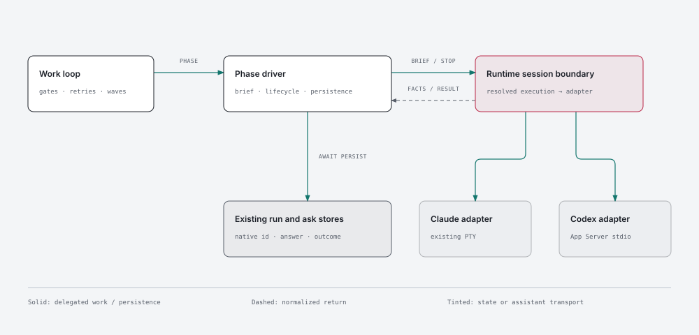

# 154 · Architecture decisions

## Grounding

RESEARCH R1–R6 distinguish observed code/schema facts from pending live evidence. Graph refresh
timed out; source imports establish the coupling. Recall's native-identity, honest-capability and
freshness rules are honoured. No near-miss was surfaced. Supersede Claude-only execution assumptions
at these seams without editing historical ADRs or delivered features.

## ADR-001: Runtime adapters behind one session boundary

**Status:** Accepted. **Date:** 2026-10-06.

**Context.** Phase and worker callers share execution but currently bind Claude specifics (R1).
**Decision.** Execution owns `runtime-session.mjs`: `drive(brief, options)`, runtime capability
inspection and resumability. Brief adds structured phase/arguments; options carry resolved execution,
signal, deadlines and awaited callbacks for identity, activity, question and usage. Results preserve
`done | failed | needs-input`, sessionId and failureReason. Wrap the existing Claude implementation;
core assembles adapters. Protocol parsing and transcript lookup stay inside adapters.
**Alternatives.** Forking the loop duplicates gates; rewriting Claude risks unrelated regressions.
**Consequences.** Old exports remain compatible; unknown runtime is an explicit refusal.

### Diagram

Why: show ownership across two transports. View: components. Components: loop, phase driver,
session boundary, Claude PTY, Codex stdio, run/ask stores. Flows: brief and cancellation down;
identity/events/result up; the phase driver persists facts before settling.

Assumption: static doc-wide component view; individual protocol messages belong in ADR-003/004.

Source: [ADR-001-runtime-session.html](diagrams/ADR-001-runtime-session.html) · PNG: [ADR-001-runtime-session.png](diagrams/ADR-001-runtime-session.png)

## ADR-002: Resolve runtime and model once, retain provenance

**Status:** Accepted. **Date:** 2026-10-06.

**Context.** Installation, role models and session models are different choices.
**Decision.** New execution resolves `--runtime`, then `work.loop.runtime`, then `claude`.
`work.agents.runtimes.<runtime>` holds `session`, `models`, `effort`; scoped Claude values override
legacy equivalents, while Codex never inherits Claude aliases. Flag choices override scoped config.
Validate requested model/effort against runtime capability data. Record an additive `execution`
envelope on declarations/runs: runtime, transport, profile version, resolved phase settings and
their sources. Keep native identity solely in existing `sessionId`. Missing legacy execution means
Claude with legacy resume behavior. New recorded executions retain their settings; conflicting
resume flags refuse before mutation. A fresh run permits new choices.
**Alternatives.** Inferring runtime from model names is ambiguous.
**Consequences.** Repair uses continue's settings; child/mesh hand-offs carry the same envelope.

## ADR-003: Codex uses versioned App Server over stdio

**Status:** Accepted. **Date:** 2026-10-06.

**Context.** The installed public schema supports required lifecycle operations (R2).
**Decision.** One server process per phase drive, JSON-RPC over stdio, injected spawn and bounded
stream parser. Initialize before thread/turn calls; resume by native id only. Start with profile
`codex-app-server-v1`, candidate CLI 0.130.0; promote versions to supported only after live probes.
Use existing auth without reading/copying credentials. Require a final output-schema envelope
`complete | needs_input | failed`; completed transport alone is insufficient. Unexpected mandatory
requests refuse; diagnostics are bounded/redacted. No automatic exec or PTY fallback.
**Alternatives.** Exec cannot provide the same interactive transport; screen scraping adds fragility.
**Consequences.** Protocol fixture tests run offline; live profile proof gates integration.

## ADR-004: Durable asks are independent of transient RPC requests

**Status:** Accepted. **Date:** 2026-10-06.

**Context.** Pending request ids need not survive interruption (R3).
**Decision.** Await persistence of each normalized question, token, options and native identity in
the existing ask store before interrupting/parking. Resume with a new turn containing the recorded
question and authorized answer; never replay stale RPC ids. A final structured question is the
fallback when no native question tool is available. Multiple questions serialize under one pending
ask per run. Exact duplicates are idempotent; conflicting questions fail visibly. Keep delivery state
until acknowledged so a crash cannot lose an answer. Ambiguous delivery is reconciled, not blindly
replayed. Missing question sessions halt; cold fixes remain permitted under existing fix policy.
Permission requests are declined and surfaced for operator action, never converted into business
answers or auto-approved. Deadlines/heartbeats reuse the loop's existing policy.
**Alternatives.** Keeping every parked process alive wastes resources and cannot survive restart.
**Consequences.** Business answers, permission decisions and completion have distinct outcomes.

## ADR-005: Render native assets with explicit ownership

**Status:** Accepted. **Date:** 2026-10-06.

**Context.** One runtime root cannot place all Codex asset kinds correctly (R4).
**Decision.** Resolve roots per kind: Codex skills `.agents/skills`, agents `.codex/agents/*.toml`,
guidance at the actual project directory. Render required native fields, model/effort and supported
invocation policy. Exact directory scopes map to nested guidance; globs remain explicit advisory
conditions in root guidance with a warning. Shared config/hooks/guidance use ownership-aware merge;
unowned collisions refuse. Delete obsolete files only when lock-owned and unchanged. A drifted old
skill prevents installing a duplicate new skill. Keep credentials and trust approvals user-owned.
**Alternatives.** Whole-file writes erase unrelated settings; duplicate layouts create ambiguity.
**Consequences.** Apply is idempotent; generated references and worktree copies use resolved paths.

## ADR-006: Shared contracts, runtime variants, focused references

**Status:** Accepted. **Date:** 2026-10-06.

**Context.** Compatibility preambles do not translate procedures (R4/R6).
**Decision.** Extend existing overrides to bundle members: common body/metadata, runtime variant,
then project override. Typed references resolve procedures, roles and associated files after mapping.
Runtime selects the variant automatically. Keep critical scope/gate rules in entry skills and load
only relevant supporting procedures. Native orchestration is explicit and bounded; cross-runtime
delegation remains separately opt-in. Use effective runtime tools, not imaginary Claude permissions.
**Alternatives.** Full duplicated template trees drift; runtime branches in every paragraph bloat.
**Consequences.** Preserve all existing Claude/OpenCode semantics; optimize against behavioral evals.

## ADR-007: Normalize observation without inventing measurements

**Status:** Accepted. **Date:** 2026-10-06.

**Context.** Claude transcript analysis does not describe Codex events (R5).
**Decision.** Adapter events feed shared activity and usage records. Attribute deltas per run/turn,
deduplicate reconnects, preserve native session identity, and mark unavailable fields null. Token
usage is not subscription cost; Claude cache thresholds do not grade Codex. Driver-owned heartbeat
does not require trusted hooks. Mesh validates runtime capability before accepting execution.
**Alternatives.** Reusing Claude parsers creates false zeroes and lost sessions.
**Consequences.** Existing record consumers gain optional data, not a second ledger.

## ADR-008: Explicit memory choice and configuration-only UI

**Status:** Accepted. **Date:** 2026-10-06.

**Context.** Graphify currently selects Claude; UI already owns configuration editing (R5/R6).
**Decision.** Expose `memory.graphify.extractionBackend` with supported existing backend vocabulary;
legacy absence retains Claude extraction and reports it. Codex preflight names that dependency and
the existing local backend alternative; never switches silently. UI edits runtime and scoped models
using existing schema validation and shows resolved provenance; no apply/launch side effects.
**Alternatives.** Guessing a Codex Graphify backend lacks evidence.
**Consequences.** Existing memory contracts remain shared; UI uses DESIGN's binding checklist.

## Fitness functions

Each pending test is registered through its family index and `scripts/test-unit.mjs` by the owning
story. Red-probe evidence is owed in VERIFICATION at delivery, not fabricated at refine.

| id | invariant | enforced by (arch-test) | from |
|---|---|---|---|
| FF-15401 | Loop engine contains no vendor protocol/transcript policy | `test/arch/session/acd-runtime-session-boundary.test.mjs` — pending | ADR-001 |
| FF-15402 | Runtime resolution has one owner and retains legacy semantics | `test/arch/session/acd-runtime-choice-owner.test.mjs` — pending | ADR-002 |
| FF-15403 | Codex execution cannot bypass permissions or fall back silently | `test/arch/session/acd-codex-permission-boundary.test.mjs` — pending | ADR-003, ADR-004 |
| FF-15404 | Codex generated paths and co-authored writes have one owner | `test/arch/store/acd-codex-output-ownership.test.mjs` | ADR-005 |
| FF-15405 | Bundle runtime variants resolve references before rendering | `test/arch/command/acd-bundle-runtime-variants.test.mjs` | ADR-006 |
| FF-15406 | Runtime observation never fabricates identity or cost | `test/arch/session/acd-runtime-observation-facts.test.mjs` — pending | ADR-007 |
