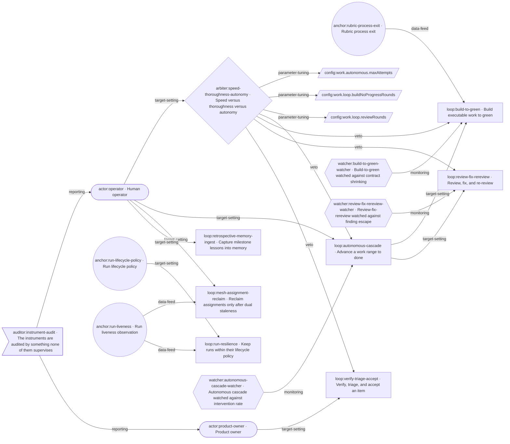

<!-- aof-generated: `aof work loops document --write` – do not edit by hand -->

# The loop graph

The control loops this repository declares, projected from the loop registry at `.aof/loops`.
Regenerate with `aof work loops document --write` after any change to a loop record.

## Health

- Declared records: 17
- Declared edges: 23
- Findings: 0 error, 33 warning

| check | findings |
| --- | --- |
| grounding | 11 |
| anchor-grounding | 4 |
| pairing | 0 |
| reference-ownership | 0 |
| actuator-arbitration | 0 |
| timescale | 0 |

The diagram below draws every endpoint a record points at, including endpoints no record
declares; the record count above counts declared records only.

## The graph

## The records

### `actor:operator` – Human operator

- kind: actor
- ground: exogenous

### `actor:product-owner` – Product owner

- kind: actor

### `anchor:rubric-process-exit` – Rubric process exit

- kind: anchor
- ground: process-exit
- observes: module:src/commands/grade.mjs#reportObservation

### `anchor:run-lifecycle-policy` – Run lifecycle policy

- kind: anchor
- ground: frozen-rule
- observes: module:src/run-store.mjs#isLegalTransition

### `anchor:run-liveness` – Run liveness observation

- kind: anchor
- ground: live-soak
- observes: module:src/run-store.mjs#isStale

### `arbiter:speed-thoroughness-autonomy` – Speed versus thoroughness versus autonomy

- kind: arbiter
- resolves: how much of the same agent's effort each loop may spend
- priority: loop:verify-triage-accept, loop:review-fix-rereview, loop:build-to-green, loop:autonomous-cascade
- dwell: cycles:2

### `auditor:instrument-audit` – The instruments are audited by something none of them supervises

- kind: auditor
- audits: module:scripts/test.mjs#tests, module:src/work-audit/census.mjs#runCensus, module:src/work-audit/evidence.mjs#runEvidence, module:src/work-audit/spawn.mjs#runBounded, module:src/work/doctor-controls.mjs#fitnessDeclarations, module:src/work/loops-checks.mjs#buildGroundednessReport, command:work:loops-validate, watcher:autonomous-cascade-watcher, watcher:build-to-green-watcher, watcher:review-fix-rereview-watcher, anchor:rubric-process-exit, anchor:run-lifecycle-policy, anchor:run-liveness
- measurement: command:work:audit
- cadence: event:per-milestone
- escalation: actor:operator

### `loop:autonomous-cascade` – Advance a work range to done

- kind: loop
- controlled: items reaching done over a work range
- reference: command:work:next
- measurement: command:work:next
- actuator: prose:src/bundle/agents/aof-product-owner.md, prose:src/bundle/agents/aof-developer.md, prose:src/bundle/agents/aof-qa.md
- cadence: event:per-item
- ceiling: config:work.autonomous.maxAttempts
- owner: unknown
- optimizing: true
- layer: management

### `loop:build-to-green` – Build executable work to green

- kind: loop
- controlled: executable scenarios and fitness functions green
- reference: prose:src/bundle/commands/continue.md
- measurement: prose:src/bundle/commands/continue.md
- actuator: prose:src/bundle/agents/aof-developer.md
- cadence: event:per-phase
- ceiling: config:work.loop.buildNoProgressRounds
- owner: unknown
- optimizing: true
- layer: operational

### `loop:mesh-assignment-reclaim` – Reclaim assignments only after dual staleness

- kind: loop
- controlled: module:src/mesh/assignment-reclaim.mjs#reclaimStaleAssignments
- reference: module:src/mesh/assignment-reclaim.mjs#dualStalenessDecision, module:src/mesh/presence.mjs#isNodeStale, module:src/run-store.mjs#isStale
- measurement: module:src/mesh/assignment-reclaim.mjs#dualStalenessDecision, module:src/mesh/presence.mjs#isNodeStale, module:src/run-store.mjs#isStale
- actuator: module:src/effects/assignment-transitions.mjs#transitionAssignmentState, module:src/effects/run-transitions.mjs#transitionRunReclaimed
- cadence: periodic:15s
- ceiling: none
- owner: unknown
- optimizing: false
- layer: operational

### `loop:retrospective-memory-ingest` – Capture milestone lessons into memory

- kind: loop
- controlled: milestone lessons made recallable
- reference: prose:src/bundle/commands/retrospective.md
- measurement: prose:src/bundle/commands/retrospective.md
- actuator: module:src/work/memory.mjs#runMemory
- cadence: event:per-milestone
- ceiling: none
- owner: unknown
- optimizing: false
- layer: governance

### `loop:review-fix-rereview` – Review, fix, and re-review

- kind: loop
- controlled: open review findings
- reference: prose:src/bundle/commands/continue.md
- measurement: prose:src/bundle/commands/continue.md
- actuator: prose:src/bundle/agents/aof-developer.md
- cadence: event:per-phase
- ceiling: config:work.loop.reviewRounds
- owner: unknown
- optimizing: true
- layer: operational

### `loop:run-resilience` – Keep runs within their lifecycle policy

- kind: loop
- controlled: module:src/run-store.mjs#readRuns
- reference: module:src/run-store.mjs#isLegalTransition, module:src/run-store.mjs#isRetryable
- measurement: module:src/run-store.mjs#isStale, module:src/run-store.mjs#retryReadiness
- actuator: command:work:run-start, command:work:run-retry, command:work:run-complete
- cadence: event:per-run-start
- ceiling: config:work.autonomous.maxAttempts, module:src/run-store.mjs#shouldRetry
- owner: unknown
- optimizing: false
- layer: operational

### `loop:verify-triage-accept` – Verify, triage, and accept an item

- kind: loop
- controlled: findings triaged and item accepted
- reference: prose:src/bundle/commands/verify.md
- measurement: prose:src/bundle/commands/verify.md
- actuator: prose:src/bundle/agents/aof-developer.md, prose:src/bundle/agents/aof-qa.md, prose:src/bundle/agents/aof-product-owner.md
- cadence: event:per-item
- ceiling: none
- owner: actor:product-owner
- optimizing: false
- layer: management

### `watcher:autonomous-cascade-watcher` – Autonomous cascade watched against intervention rate

- kind: watcher
- counter: how often a run needed a retry or a hand
- determinism: counter
- measurement: command:work:counters

### `watcher:build-to-green-watcher` – Build-to-green watched against contract shrinking

- kind: watcher
- counter: whether the acceptance criteria got smaller
- determinism: counter
- measurement: command:work:ratchet

### `watcher:review-fix-rereview-watcher` – Review-fix-rereview watched against finding escape

- kind: watcher
- counter: findings raised after the item was accepted
- determinism: counter
- measurement: command:work:counters
